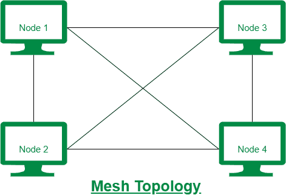
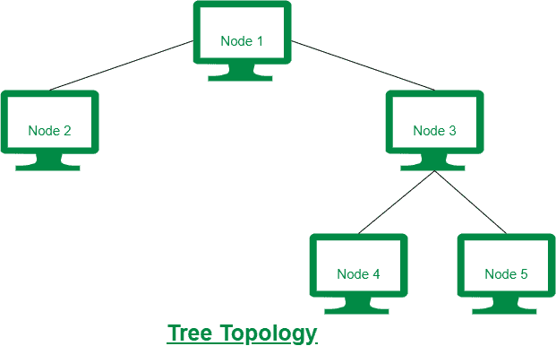

# 网状拓扑和树状拓扑的区别

> 原文:[https://www . geesforgeks . org/网状拓扑和树形拓扑的区别/](https://www.geeksforgeeks.org/difference-between-mesh-topology-and-tree-topology/)

先决条件–[网络拓扑类型](https://www.geeksforgeeks.org/types-of-network-topology/)
**1。网状拓扑:**
网状拓扑是一种网络拓扑，其中每个节点通过网络中的专用链路完全连接到其他每个节点。在网状拓扑中，连接的方式是，对于 n 个节点，需要 n(n-1)/2 个链路。网状拓扑非常昂贵，因为布线成本很高。

**2。树拓扑:**
树拓扑是一种网络拓扑，其中节点以树的设计进行组织。树形拓扑由分支电缆开始的根节点组成，分支电缆以分层方式将根节点与所有其他节点连接起来。树形拓扑比网状拓扑便宜。

网状拓扑和树状拓扑的区别如下:

| 没有。 | 网状拓扑 | 树形布局 |
| --- | --- | --- |
| 1. | 在网状拓扑中，每个节点通过专用链路完全连接到其他节点。 | 在树形拓扑中，节点是按照树形设计来组织的。 |
| 2. | 网状拓扑也称为网状网络。 | 树形拓扑也称为层次拓扑。 |
| 3. | 在网状拓扑中，数据通过两种技术传输，即路由和泛洪。 | 在树形拓扑中，数据通过没有环路的分支电缆传输。 |
| 4. | 网状拓扑中需要的电缆数量非常大。 | 树形拓扑所需的电缆数量少于网状拓扑。 |
| 5. | 网状拓扑的安全性非常高。 | 树型拓扑的安全性较高，但低于网状拓扑。 |
| six | 网状拓扑非常昂贵，因为使用的电缆更多。 | 与网状拓扑相比，树形拓扑的成本更低。 |

