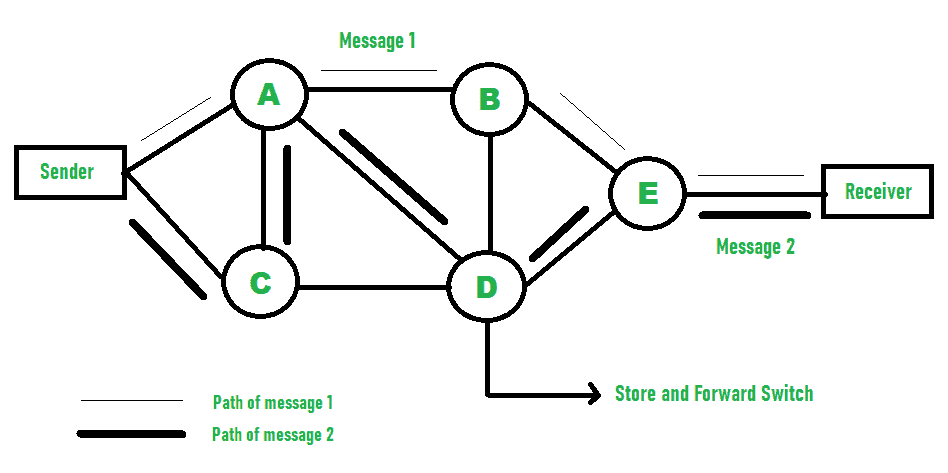
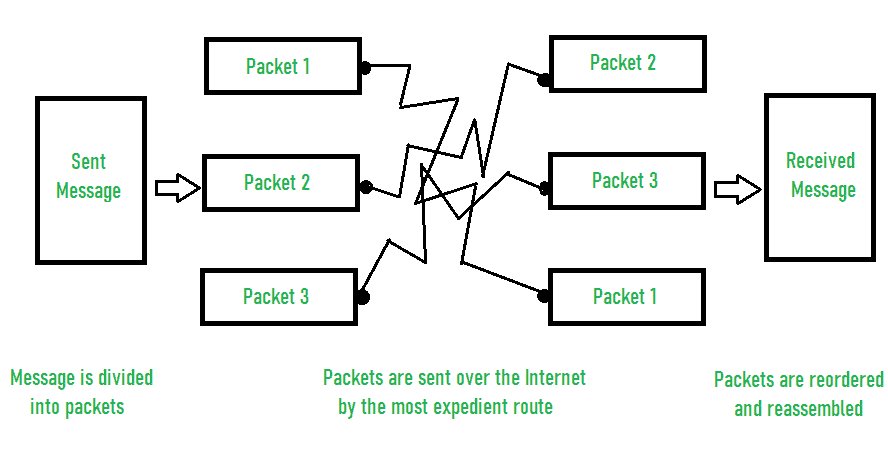

# 报文和分组交换的区别

> 原文:[https://www . geeksforgeeks . org/报文分组交换的区别/](https://www.geeksforgeeks.org/difference-between-message-and-packet-switching/)

**1。[消息切换](https://www.geeksforgeeks.org/message-switching-techniques/) :**
在这种技术中，整个消息从一个节点不间断地传输到另一个节点。它首先存储然后转发需要更多时间的信息。因此，访问时间增加。发送方和接收方之间没有直接联系。

消息切换示例–

**2。[分组交换](https://www.geeksforgeeks.org/packet-switching-and-delays-in-computer-network/) :**
在分组交换中，信息以数据包的形式在发送方和接收方之间传递。这些数据包从发送方一个接一个地转发到接收方。每个数据包都与一个报头相关联。然后，这些数据包被重组为原始消息。这提高了性能，因为访问数据包所需的时间减少了。因此，网络的整体性能得到了提高。

分组交换示例–

**报文和分组交换的区别:**

| 信息交换 | 包交换技术 |
| 完整的消息通过网络传递。 | 信息被分成更小的单元，称为数据包。 |
| 在这种情况下，使用的计算机语言是 ASCII、baudot、morse。 | 在分组交换中，使用二进制类型。 |
| 在消息交换中，块大小没有限制。 | 分组交换对块大小设置了严格的上限。 |
| 消息只存在于网络中的一个位置。 | 消息的各个部分(即数据包)存在于网络的许多地方。 |
| 例如:逐跳电传转发和 UUCP(UNIX 到 UNIX 复制协议) | 示例:帧中继、IP 和 x25 |
| 物理链路是动态分配的。 | 虚拟链接是同时进行的。 |
| 由于数据包存储在磁盘中，性能提高，访问时间缩短。 | 数据包存储在主存储器中。 |

