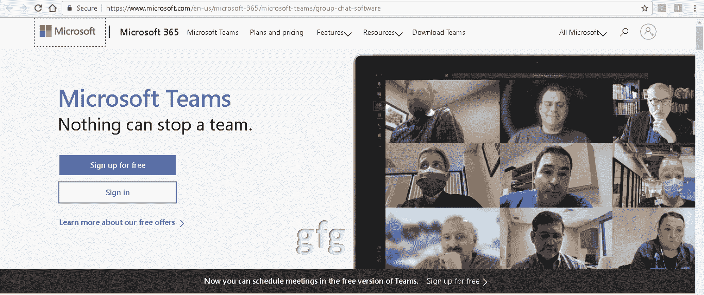
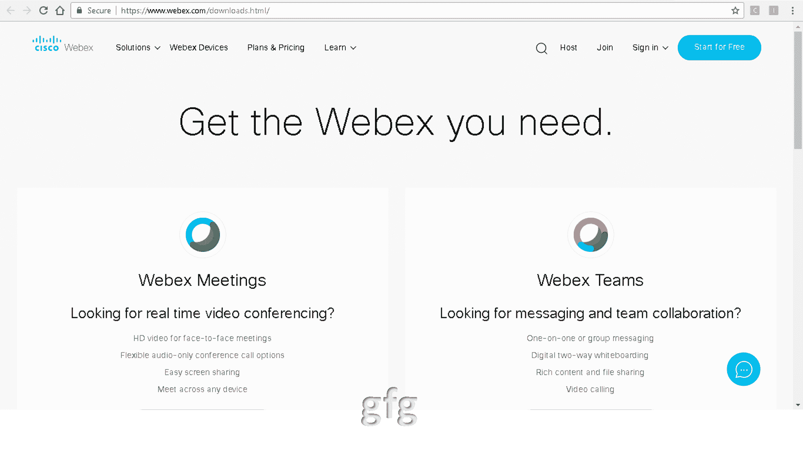

# 微软团队与思科 Webex 的区别

> 原文:[https://www . geesforgeks . org/Microsoft-teams-and-Cisco-webex 之间的区别/](https://www.geeksforgeeks.org/difference-between-microsoft-teams-and-cisco-webex/)

**1。微软团队:**
这是一款非常高效的视频会议软件。它有免费和付费两种版本。无限的聊天设施，视频和音频通话，文件和屏幕共享是该软件的一部分。它运行在[视窗](https://www.geeksforgeeks.org/interesting-facts-about-windows/)、 [Linux](https://www.geeksforgeeks.org/introduction-to-linux-operating-system/) 、苹果和[安卓](https://www.geeksforgeeks.org/introduction-to-android-development/)操作系统上。其客户包括马欣德拉和马欣德拉、Hexaware、Pidillite、Alpha Travel、毕马威等。它集成了微软 Office 365、微软 Word、微软 Excel、微软 Powerpoint、微软 One Drive 和 Sharepoint。

**这就是微软网站的样子:**

**2。思科 Webex :**
思科 Webex 提供在线会议、在线网络会议和视频会议应用。这是一款由“思科 Webex”公司开发的软件产品。该应用广泛用于举办网络研讨会、会议、在线培训、在线课程、销售演示等。

**官网就是这个样子:**

**微软团队与思科 Webex 的区别:**

| 没有。 | 微软团队 | 思科 Webex |
| --- | --- | --- |
| 1. | 它可以从网站和应用程序访问。 | 除非首选通过电话(仅音频)加入，否则必须下载应用程序。 |
| 2. | 面部修饰功能不可用。 | 外观修饰功能在此不可用。 |
| 3. | 它有音频，视频和电话呼叫设施。 | 它具有视频通话、电话通话和聊天功能。 |
| 4. | 桌面、PC、安卓、苹果设备都可以用来访问。 | 它可以在电脑和手机上访问。 |
| 5. | 背景只能用特定的股票图像来改变。完全定制化还没有出现。 | 模糊或替换背景设施是可用的。 |
| 6. | 可以为房间提供隐私(通过改变背景)。 | 它没有通过添加虚拟背景来提供额外的隐私。 |
| 7. | 它一次处理 300 个参与者。 | 它可以处理多达 10 万名参与者。 |
| 8. | 它允许无限制的视频通话。 | 里面有 40 分钟的视频通话。 |
| 9. | 付费版的价格在每月 5 到 20 美元之间。 | 它已经支付了价格标签为 13.50 美元，17.95 美元和 26.95 美元的版本 |
| 10. | 屏幕上可以有 9 个参与者。 | 它一次最多有 16 个人在屏幕上。 |
| 11. | 它与 office 365 Word Excel 和 PowerPoint onedrive 和 SharePoint 集成。 | 它可以与谷歌驱动、谷歌任务和几个这样的应用程序集成。 |
| 12. | 它比缩放更健壮。 | Webex 坚固、可靠且总体安全。 |
| 13. | 它的目标是商业客户。 | 它的主要焦点是商业实体。 |
| 14. | 人们可以实时共享和协作办公文档。 | 就 Microsoft office 文档而言，它不能用于协作。 |
| 15. | 我们无法通过谷歌日历安排通话，也无法直接从 Gmail 收件箱创建或加入通话。 | Webex 不支持从 Gmail 收件箱直接安排日程。 |
| 16. | 它不支持背景噪声过滤。 | 它没有任何噪声消除机制。 |
| 17. | 微软是它的开发者。 | 它是由思科 Webex 公司开发的。 |
| 18. | 它是在 2017 年开发的。 | 思科 Webex 成立于 2007 年，当时思科收购了 Webex。 |

