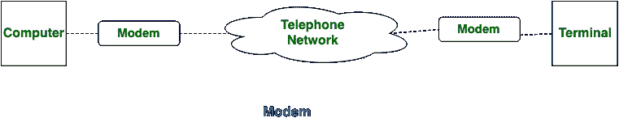
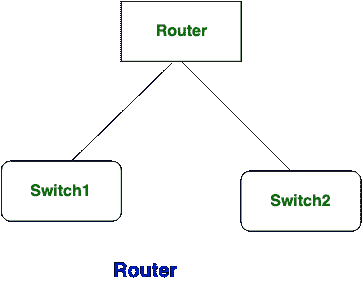

# 调制解调器和路由器的区别

> 原文:[https://www . geesforgeks . org/modem-and-router 的区别/](https://www.geeksforgeeks.org/difference-between-modem-and-router/)

无论电子设备将您的笔记本电脑或网络连接到互联网服务提供商以访问网络，调制解调器和**路由器**都会测量网络设备。

一个**路由器**应该用来连接完全不同的网络。电子设备和路由器之间的本质区别在于，电子设备是将您的电子网络连接到网络所必需的，而路由器则是引导网络上信息包流量的关键。

**调制解调器和路由器的区别:**

| S.NO | 调制解调器 | 路由器 |
| 1. | 调制解调器可以是包含症状调制器和症状整流器组合的设备。 | 而路由器可能是连接多个网络的设备。 |
| 2. | 电子设备将笔记本电脑的数字信号转换成模拟信号，反之亦然。 | 路由器检查信息包并验证其路径，以便在目标电脑上成功传输。 |
| 3. | 调制解调器将请求的信息从网络传送到您的网络。 | 而路由器将请求数据分发到您的电脑。 |
| 4. | 调制解调器对接入网络至关重要，因为它将您的笔记本电脑连接到互联网服务提供商。 | 而在不使用路由器的情况下，您可以访问网络。 |
| 5. | 它是用数据链路层实现的。 | 而它是用网络层实现的。 |
| 6. | 在现代，信息包不被检查；因此，安全威胁经常存在。 | 在路由器中，信息包总是在转发之前被检查，以找出威胁。 |
| 7. | 它可以直接放在电脑上，也可以放在电话线和路由器之间。 | 而路由器被放置在电子设备和网络之间。 |
| 8. | 调制解调器通过解码 ISP 信号来执行信号解码。 | 而路由器不执行信号解码。 |

