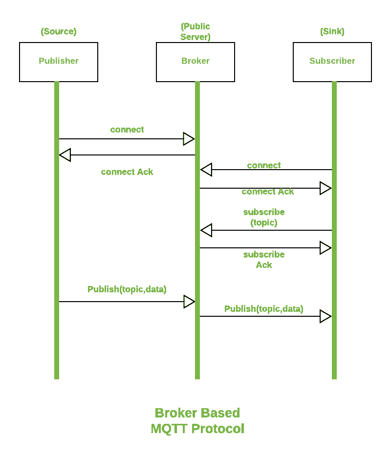

# 【MQTT 和 HTTP 协议的区别

> 原文:[https://www . geeksforgeeks . org/mqtt 和 http 协议之间的区别/](https://www.geeksforgeeks.org/difference-between-mqtt-and-http-protocols/)

**1。消息队列遥测传输(MQTT) :**
它是由安迪·斯坦福德-克拉克和阿尔伦·尼珀创建的。这是一个基于发布/订阅模型的[物联网](https://www.geeksforgeeks.org/introduction-to-internet-of-things-iot-set-1/)交互协议。这个模型是一个简单的模型，为服务质量提供支持。由于它的能力，每秒钟都能在基于物联网的设备中找到它。该协议比 [TCP](https://www.geeksforgeeks.org/tcp-ip-model/) 有很多特点，使用 SSL/TLS 进行安全保护。对于服务器之间的消息传递，它使用 CONNECT、PUBLISH、SUBSCRIBE、DISCONNECT 等。

**2。[超文本传输协议(HTTP)](https://www.geeksforgeeks.org/http-non-persistent-persistent-connection/) :**
它被[万维网(WWW)](https://www.geeksforgeeks.org/world-wide-web-www/) 用于定义其消息将如何被传输和格式化。该协议负责服务器在网络上发送信息时必须采取的行动。当一个网址被输入到浏览器中时，这个协议向服务器发送一个 HTTP 请求，然后一个 HTTP 响应被发送回浏览器。该协议还负责控制万维网上网页的格式和表示。

**MQTT 和 HTTP 协议的区别:**

| 参数 | MQTT | 超文本传送协议 |
| --- | --- | --- |
| 缩写 | 消息队列遥测传输 | 超文本传输协议 |
| 体系结构 | 它在发布/订阅模式下工作。 | 它适用于请求/响应模型。 |
| 复杂性 | 它没有那么复杂。 | 它更复杂。 |
| 复查 | 它运行在传输控制协议上。 | 它运行在传输控制协议(TCP)之上，也可以适应[用户数据报协议](https://www.geeksforgeeks.org/user-datagram-protocol-udp/)。 |
| 协议设计 | 该协议的设计以数据为中心。 | 该协议的设计以文档为中心。 |
| 消息大小 | 生成的消息大小较小，因为它使用二进制格式。 | 生成的消息大小更大，因为它使用 ASCII 格式。 |
| 标题大小 | 它有两个字节。 | 它有 8 个字节。 |
| 通道数 | 它在 1883 端口工作。 | 它在 80 或 8080 端口上工作。 |
| 数据安全 | 它通过 SSL/TLS 提供数据安全性。 | 它不提供安全性，但 Https 就是为此而构建的。 |

