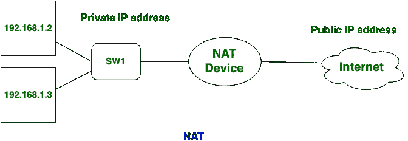
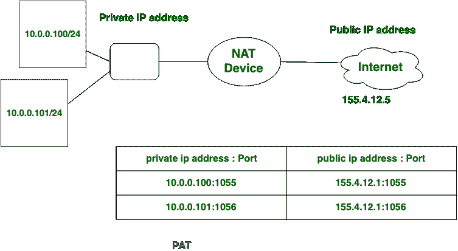

# 网络地址转换(NAT)和端口地址转换(PAT)的区别

> 原文:[https://www . geeksforgeeks . org/network-difference-address-translation-NAT-and-port-address-translation-pat/](https://www.geeksforgeeks.org/difference-between-network-address-translation-nat-and-port-address-translation-pat/)

**[网络地址转换(NAT)](https://www.geeksforgeeks.org/computer-network-network-address-translation-nat/) :**
NAT，将私有 IP 地址或本地地址转换为公有 IP 地址。NAT 通过将本地 ip 或私有 IP 地址转换为全局或公共 IP 地址来减缓可用 IP 地址的耗尽速度。NAT 可以是一对一关系，也可以是多对一关系。



**[端口地址转换(PAT)](https://www.geeksforgeeks.org/computer-network-port-address-translation-pat-on-adaptive-security-appliance-asa/) :**
在 PAT 中，私有 IP 地址通过端口号转换为公共 IP 地址。PAT 也使用 IPv4 地址，但带有端口号。它有两种类型:

```
1. Static
2. Overloaded PAT 
```



**网络地址转换(NAT)和端口地址转换(PAT)的区别:**

| S.NO | 网络地址转换 | 端口地址转换 |
| 1. | NAT 代表网络地址转换。 | PAT 代表端口地址转换。 |
| 2. | 在网络地址转换中，私有地址被转换成公共地址。 | 在 PAT 中，私有 IP 地址通过端口号转换为公共 IP 地址。 |
| 3. | NAT 可以被认为是 PAT 的超集。 | PAT 是一个动态 NAT。 |
| 4. | NAT 使用 IPv4 地址。 | PAT 也使用 IPv4 地址，但带有端口号。 |
| 5. | 它有三种类型:静态，动态网络地址转换和 PAT/网络地址转换过载/IP 伪装。 | 它也有两种类型:静态和重载 PAT。 |