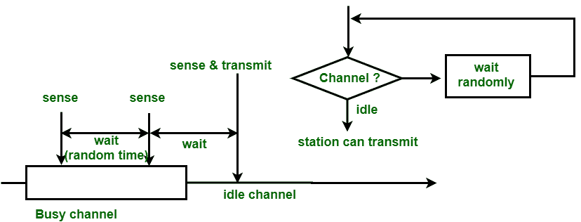

# 非持久性和 p 持久性 CSMA 的区别

> 原文:[https://www . geeksforgeeks . org/区别-非持久-和-p 持久-csma/](https://www.geeksforgeeks.org/difference-between-non-persistent-and-p-persistent-csma/)

先决条件–[载波侦听多路访问(CSMA)](https://www.geeksforgeeks.org/carrier-sense-multiple-access-csma/)

**1。非持久性 CSMA :**
在非持久性 CSMA 中，有帧要发送的电台只对频道有感觉。在空闲信道的情况下，它会立即将帧发送到该信道。如果发现信道繁忙，它将等待一段固定的时间，并再次检测站的状态是空闲还是繁忙。在这种方法中，当该站检测到前一次传输结束时，它不会仅仅出于捕获的目的而立即感测该信道。这种方法减少了冲突的机会，但降低了网络的效率。

**Figure –** Non-persistent CSMA

**2。p-persistent CSMA–**
当一个信道有时隙，并且该时隙持续时间等于或大于该信道的最大传播延迟时间时，使用 p-persistent CSMA。当电台准备发送帧时，它将感知频道。如果发现频道忙，电台将等待下一个时隙。但是如果发现信道空闲，该站立即以概率 p 发送该帧。因此，该站等待下一个时隙开始的剩余概率，即等于 1-p 的 q。如果发现下一个时隙也是空闲的，则该站发送或以概率 p 和 q 再次等待，这个过程重复进行，直到帧被发送或者另一个站开始发送。

**Figure –** p-persistent CSMA

**非持续性和 p 持续性 CSMA 的区别:**

| 参数 | 非持久性 CSMA | 持久性 CSMA |
| --- | --- | --- |
| 载波侦听 | 当信道空闲时，它将发送帧。 | 当信道空闲时，它将以概率 p 发送。 |
| 等待 | 它将随机等待一段时间来检查承运人。 | 它将等待帧传输的下一个时隙。 |
| 碰撞几率 | 在这种方法中，碰撞的几率比 p-persistent 更大。 | 在这种方法中，碰撞的机会比非持久方法少。 |
| 利用 | 它的利用率高于 1-持久，因为在这种情况下，所有的站都在同一时间不断地检查信道。 | 它的利用取决于概率 p。 |
| 延迟低负载 | 它比 1 长-持久，因为它只在信道繁忙时随机检查。 | 当概率 p 较小时，它较大，因为站不会总是在信道空闲状态下发送。 |
| 延迟高负载 | 由于碰撞，它很高。 | 当发现信道处于空闲状态时，发送的概率 p 较小时，该概率较大。 |

