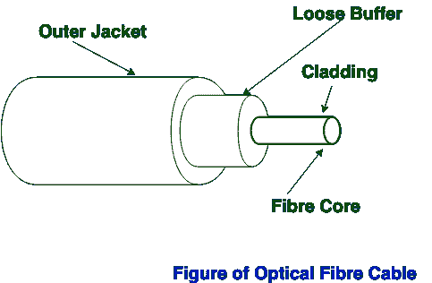
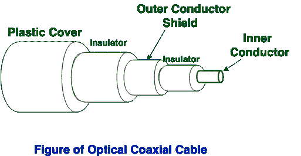

# 光纤和同轴电缆的区别

> 原文:[https://www . geesforgeks . org/光纤和同轴电缆的区别/](https://www.geeksforgeeks.org/difference-between-optical-fibre-and-coaxial-cable/)

光缆和同轴电缆都是[类型的导向介质](https://www.geeksforgeeks.org/types-transmission-media/)。
**光缆:**
光纤是一种由塑料和玻璃制成的导向介质，用于传输光形式或光学形式的信号。它提供了高带宽。它的安装和实施不像同轴电缆那么容易。

**同轴电缆:**
同轴电缆是一种由塑料制成的导向介质，用于传输信号的铜线是电的形式，而不是光的形式。它的安装和实施很容易，但它的效率低于光纤，而且与光纤相比，它提供了中等的高带宽。

<figure class="table">

| S.NO | 光纤 | 同轴电缆 |
| 1. | 光纤用于传输光形式的信号/数据。 | 同轴电缆用于传输电子形式的信号/数据。 |
| 2. | 光纤是由塑料和玻璃制成的。 | 同轴电缆由塑料、铜线等制成。 |
| 3. | 光纤效率高。 | 而同轴电缆效率较低。 |
| 4. | 光纤成本高。 | 同轴电缆的成本更低。 |
| 5. | 光缆重量较轻。 | 同轴电缆的重量比光纤重。 |
| 6. | 光纤的直径很小。 | 同轴电缆的直径比光纤大。 |
| 7. | 光纤的安装和实施很困难。 | 同轴电缆的安装和实施很容易。 |
| 8. | 在光纤中，抗噪声能力最高，因为它们不受电噪声的影响。 | 由于提供了屏蔽，同轴电缆具有最好的抗噪性。 |
| 9. | 这些电缆不受外部磁场的影响。 | 同轴电缆受外部磁场的影响较小。 |
| 10. | 光纤中发生的功率损耗是由吸收、散射、色散和弯曲引起的。 | 同轴电缆中的功率损失仅是由于传导。 |
| 11. | 它使用 10BaseF、100BaseFX、1000BaseFx 和其他一些以太网变体。 | 它使用 10Base2 和 10Base5 以太网变体。 |
| 12. | 它的最大传输速度高达 10 Gbps。 | 它的最大传输速度高达 10 Mbps。 |

</figure>