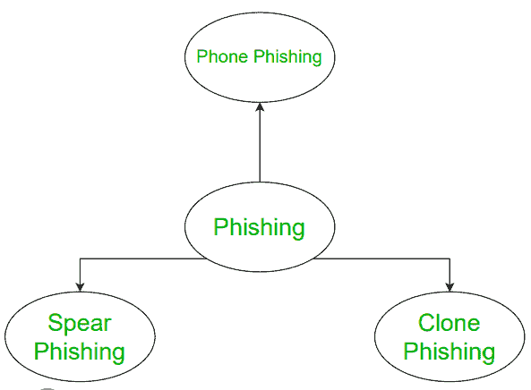
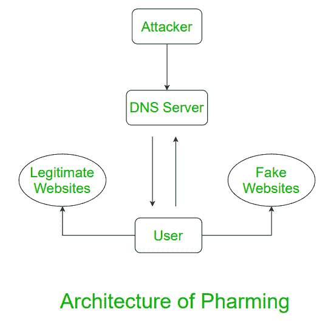

# 网络钓鱼和域名欺诈的区别

> 原文:[https://www . geesforgeks . org/网络钓鱼和域名欺诈的区别/](https://www.geeksforgeeks.org/difference-between-phishing-and-pharming/)

**:
网络钓鱼是对计算机设备的一种攻击。在网络钓鱼中，攻击者试图通过电子通信的方式非法发现用户的敏感信息。换句话说，这是非法企图获取人民或用户的安全信息。**

**网络钓鱼的一个简单例子是银行欺诈，黑客试图以银行员工的身份通过通信获取您的银行详细信息，这是一种欺诈方式。**

****

****:
域名注册是一种更先进的技术，通过努力将用户输入网站来获取用户凭据。换句话说，它将用户误导到一个看起来是官方的假网站，受害者错误地提供了他们的个人信息。****

****在域名欺诈中，虚假网站被创建，看起来是官方的。然后，用户访问网站，并弹出关于用户名、密码和其他凭证的请求。****

********

****让我们看看网络钓鱼和域名欺诈的区别:****

| 没有 | 网络钓鱼 | 网址嫁接 |
| --- | --- | --- |
| one | 在网络钓鱼中，攻击者试图通过电子通信的方式非法发现用户的敏感信息。 | 域名注册是一种更先进的技术，通过努力让用户进入网站来获取用户证书。 |
| Two | 这是一种通过电子邮件或即时消息一次骗一个人的企图。/td > |

****它只是将流量从一个网站重定向到不同的、外观相同的网站，以窃取信息。three这是一个电子邮件诈骗。这与电子邮件钓鱼的本质相似。four这是一种欺诈，攻击者通过电子邮件或消息欺骗受害者提供个人信息。这是一个骗局，试图通过域名欺骗获得个人和私人信息。five启动和识别相对容易。更难完成和识别。six它涉及一封欺诈性电子邮件，其中包含一个网站链接，该网站向用户寻求个人详细信息。它毒害了域名系统服务器，将用户重定向到不同的网站。seven它使用邮件。It uses websites.****