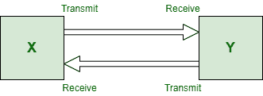
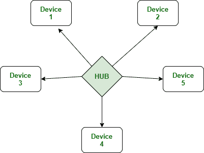

# 点对点链路和星型拓扑网络的区别

> 原文:[https://www . geesforgeks . org/点对点链路与星型拓扑网络的区别/](https://www.geeksforgeeks.org/difference-between-point-to-point-link-and-star-topology-network/)

**1。点对点链路:**
这种拓扑依赖于两个功能，即发送和接收。它是两个通信节点之间的一种通信网络，其中一个是发射机，另一端是接收机。它是一种具有两个端点或端节点的通信媒介。它们通过两个系统之间的专用通信连接提供高带宽。

**2。[星型拓扑](https://www.geeksforgeeks.org/types-of-network-topology/) :**
这是一种包含一个中心节点的拓扑，所有其他节点或不同节点都通过一条路径连接到该节点。在这种拓扑中，每台主机都连接到一个中央集线器。

**点对点链路和星型拓扑网络的区别:**

| 点对点链接 | 星形布局 |
| --- | --- |
| 它以几种方式生长。 | 它有助于提供便捷的服务。 |
| 这是一种基本上只依赖于发送和接收两种功能的链路。 | 每个连接只有一个设备。 |
| 每个站或节点仅从一个发射机接收信号。 | 非常可靠。 |
| 每个发射机只向一个接收机发送信号。 | 它对问题诊断进行集中控制。 |
| 发送和接收操作都可以通过单独的线路进行。 | 它有简单的访问协议。 |
| 它是高带宽网络的类型。 | 它有一个非常长的电缆长度网络。 |
| 与其他网络类型相比，网络拓扑非常快速。 | 所有的依赖都在中心节点上。 |
| 它非常简单，易于连接。 | 这是一个高性能，因为没有数据冲突。 |
| 有助于提供低延迟。 | 检测故障和拆卸零件非常容易。 |
| 它很容易维护和处理。 | 它比其他网络拓扑更昂贵。 |
| 他们的节点很容易在几秒钟内被替换。 | 安装和接线都很容易。 |

