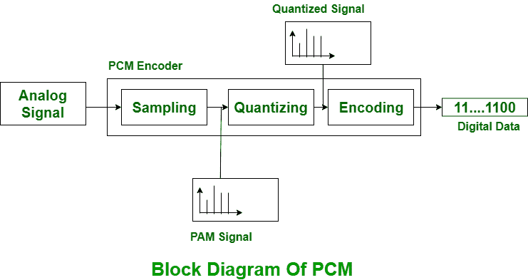
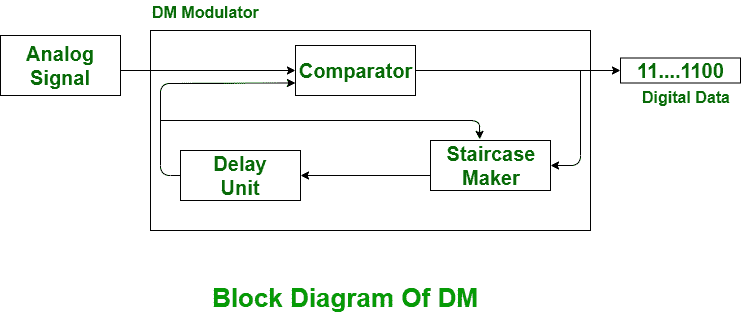

# 脉码调制和增量调制的区别

> 原文:[https://www . geesforgeks . org/脉码调制-PCM-和-delta-调制-dm/](https://www.geeksforgeeks.org/difference-between-pulse-code-modulation-pcm-and-delta-modulation-dm/) 之差

**脉码调制(PCM):**
是将模拟信号重新加工成数字信号的技术。动力系统控制模块具有良好或可感知的信噪比。对于传输，脉冲编码调制需要高发射机带宽。PCM 技术分为三个要素，最初是在提供端的传输，其次是在传输路径和接收端的再生。

**δ调制(DM):**
δ调制是一种模数和数模信号转换技术。采用增量调制实现高信噪比。它用一位 PCM 码实现模拟信号的数字传输。对于增量调制，不是发送样本的编码图示，而是仅发送一个比特，这仅仅指示样本是大于还是小于前一个样本。这是最好或最简单的差分脉冲编码调制类型。增量调制信号小于脉码调制系统。

如果信号很大，则数字数据的下一位为 1，否则为 0。

**脉码调制(PCM)与增量调制(DM)的区别:**

| S.NO | 脉冲编码调制 | 分米 |
| --- | --- | --- |
| 1. | PCM 代表脉冲编码调制。 | DM 代表增量调制。 |
| 2. | 在动力系统控制模块中，反馈不存在于发射器或接收器中。 | 而在 DM 中，反馈存在于发射机中。 |
| 3. | 每个样本使用 4、8 或 16 位。 | 这里，每个样本只使用一位。 |
| 4. | PCM 要求最高的发射机带宽。 | DM 要求最低的发射机带宽。 |
| 5. | 从实现的复杂性来看，PCM 是复杂的。 | 而 DM 在实现的复杂性方面比较简单。 |
| 6. | PCM 具有良好的信噪比。 | 而 DM 的信噪比较差。 |
| 7. | 动力系统控制模块成本很高。 | DM 便宜。 |
| 8. | PCM 可能是一种习惯于数字表示采样模拟信号的技术。 | 数模和模数转换器。 |
| 9. | 在 PCM 中，信号需要编码器和解码器。 | 在数据挖掘中，信号可以进行调制和解调。 |
| 10. | PM 主要用于视频电话和音频电话。 | 数据挖掘主要用于演讲和图像。 |

