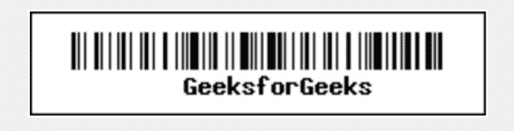
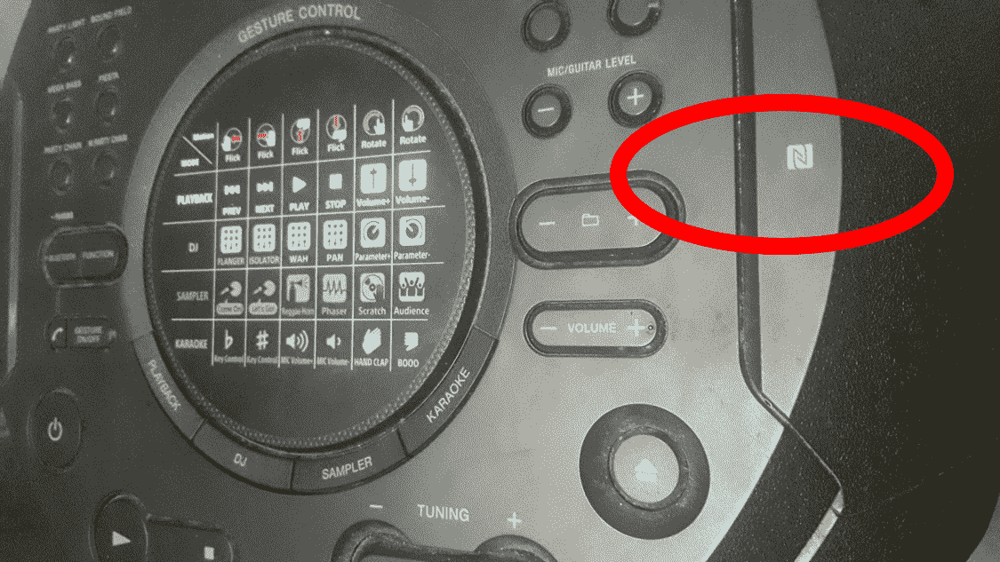

# 二维码、条形码和 NFC 的区别

> 原文:[https://www . geesforgeks . org/QR-code-bar-code-and-NFC 之间的区别/](https://www.geeksforgeeks.org/difference-between-qr-code-bar-code-and-nfc/)

**1。条形码:**
条形码是一种广泛使用的方法，以计算机可理解的格式以图像形式存储信息。它使用线条和空格来存储数字。计算机可以使用扫描仪(也称为条形码扫描仪)检索存储的号码。其中，它被广泛用于零售、汽车租赁、住院行业。

**扫描极客的条形码–**

**2。** [**二维码**](https://www.geeksforgeeks.org/how-to-generate-and-read-qr-code-with-java-using-zxing-library/) **:**
二维码是用来存储数据的二维条码。二维码扫描仪扫描这些代码，以获取存储在其中的信息。它们是 1994 年在日本开发的。它们是一种存储多媒体数据(视频、音频、图片、链接等)的方法。)水平和垂直。

**扫描到 www.geeksforgeeks.org 的二维码–**

**3。** [**【近场通信(NFC)**](https://www.geeksforgeeks.org/near-field-communication-nfc/)**:**
2002 年由飞利浦和索尼推出。NFC 是一种近场通信方法，在保持 4 厘米或更短距离的两个设备之间传输数据变得非常有用。它基于耦合原理(电感耦合)。

**扬声器上的 NFC–**

**二维码、条码**、**与 NFC 的区别:**

<figure class="table">

| 没有。 | 条形码 | 二维码 | 国家足球联盟 |
| --- | --- | --- | --- |
| 1. | 它是在 1952 年开发的。 | 它是在 1994 年开发的。 | 它是在 2002 年开发的。 |
| 2. | 它是由诺曼·约瑟夫·伍德兰开发的。 | 它是由原正弘开发的。 | 它是由弗朗茨·阿姆特曼和菲利普·曼加斯开发的。 |
| 3. | 有两种类型，一维和二维，或条形码。 | 只有 1 种类型。 | 只有 1 种类型。 |
| 4. | 这是一种以印刷和计算机可理解的格式存储数字的方式。 | 它是一种 2D 条形码或打印的数据表示，可以扫描进行数据检索。 | 它是一种通信协议，用于 4 厘米距离内的设备(电子设备)之间的通信。 |
| 5. | 它在商店用于跟踪所有购买的物品，在医院用于跟踪病人的记录，在租车业务中用于跟踪航空行李、邮件和核废料。 | 超市、医院、电影院或个人使用等。用于传输数据(共享联系人、照片、视频和其他文档。). | 它被用作身份证、钥匙卡，以及零售、汽车、电影院等各个行业的非接触式支付和移动支付方法。 |
| 6. | 它基于莫尔斯电码技术。 | 它基于莫尔斯电码技术。 | 它基于设备天线之间的电感耦合。 |
| 7. | 它需要视线。 | 它需要视线。 | 它需要接近(设备之间的距离必须小于 4 厘米，因此得名“近场”)。 |
| 8. | 一次只检查一个条形码。 | 一次只检查一个二维码。 | 一次只检查一个 NFC。 |

</figure>