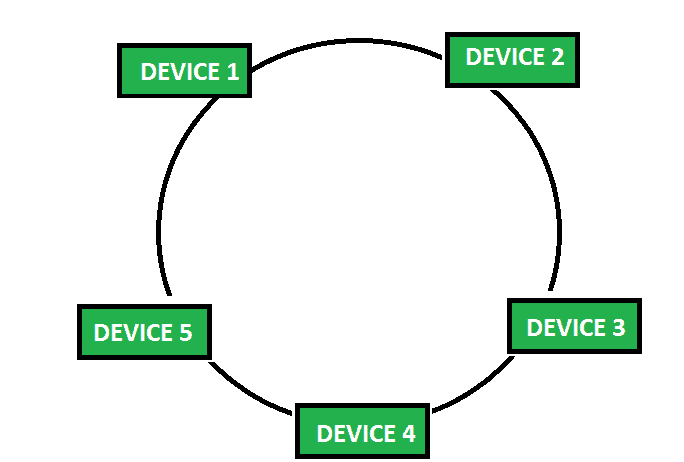
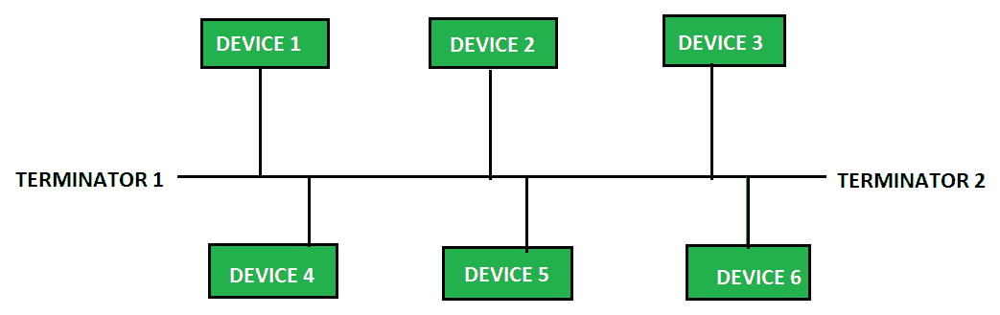

# 计算机网络中环形拓扑和总线拓扑的区别

> 原文:[https://www . geesforgeks . org/环拓扑和总线拓扑在计算机网络中的区别/](https://www.geeksforgeeks.org/difference-between-ring-topology-and-bus-topology-in-computer-networks/)

先决条件–[网络拓扑类型](https://www.geeksforgeeks.org/types-of-network-topology/)

**1。环形拓扑:**
环形拓扑中有一条环形数据路径。每个设备都连接到网络中的另外两个设备。数据通过从一个设备传递到另一个设备，从发送方传输到接收方，直到到达接收方设备。如果任何一个连接中断，整个网络就会崩溃，因为它们是按顺序连接的。这种拓扑基本上用于局域网或广域网的连接。

**2。总线拓扑:**
总线拓扑是一种网络拓扑，其中所有设备都连接到一根电缆，该电缆被称为网络的主干。它由电缆两端的终端组成。网线负责设备之间的通信，当数据到达网线末端时，它会被终结器从数据线上移除。当设备以线性方式连接时，这是最简单的网络拓扑。

**环形拓扑和总线拓扑的区别:**

| 没有 | 环形拓扑 | 总线拓扑 |
| --- | --- | --- |
| 1. | 在环形拓扑中，每个设备都以环形方式连接到另外两个设备。 | 总线拓扑是一种拓扑，其中每个设备都连接到一根称为主干的电缆。 |
| 2. | 在环形拓扑中，数据通过设备从发送方发送到接收方.. | 在总线拓扑中，数据直接从发送器发送到接收器.. |
| 3. | 环形拓扑比总线拓扑实现成本低。 | 总线拓扑的实现成本高于环形拓扑 |
| 4. | 环形拓扑不太可靠，因为一个设备的故障会影响整个网络。 | 总线拓扑比环形拓扑更可靠 |
| 5. | 环形拓扑比总线拓扑更容易跟踪故障。 | 总线拓扑中很难发现故障。 |
| 6. | 在环形拓扑中添加新设备比总线拓扑更困难。 | 在总线拓扑中，很容易添加新设备。 |
| 7. | 由于顺序访问，访问速度低于总线拓扑。 | 与环形拓扑相比，访问速度更快 |
| 8. | 环形拓扑不包含任何终结符。 | 总线拓扑在两端都有终结器。 |