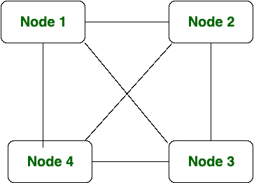
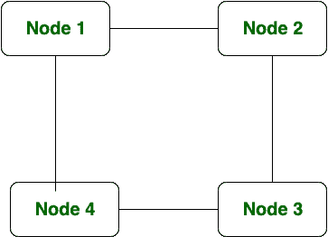

# 环形拓扑和网状拓扑的区别

> 原文:[https://www . geesforgeks . org/环拓扑和网状拓扑的区别/](https://www.geeksforgeeks.org/difference-between-ring-topology-and-mesh-topology/)

先决条件–[网络拓扑](https://www.geeksforgeeks.org/network-topologies-computer-networks/)
**网状拓扑:**
在网状拓扑中，节点通过专用链路完全相互连接，其中信息从一个节点传播到另一个节点，如果有 N 个节点，网状拓扑中有 N(N-1)/2 个链路。

**环形拓扑:**
在环形拓扑中，每个节点都连接到它的左侧和右侧节点，其中信息以环形方式在一个方向上从一个节点传播到另一个节点。如果存在 n 个节点，那么环形拓扑中也有 n 条链路，就像星形拓扑一样。在环形拓扑中，要添加新节点，必须断开整个连接。

**环形拓扑和网状拓扑的区别:**

| S.NO | 环形拓扑 | 网状拓扑 |
| 1. | 在环形拓扑中，每个节点都连接到它的左侧和右侧节点。 | 在网状拓扑中，节点通过专用链路完全相互连接。 |
| 2. | 环形拓扑的成本较低。 | 网状拓扑的成本很高。 |
| 3. | 如果有 N 个节点，环形拓扑中有 N 条链路。 | 如果有 N 个节点，网状拓扑中有 N(N-1)/2 条链路。 |
| 4. | 在环形拓扑中，信息以环形方式在一个方向上从一个节点传播到另一个节点。 | 在网状拓扑中，信息从一个节点传播到另一个节点。 |
| 5. | 环形拓扑的可扩展性较差。 | 网状拓扑的可扩展性也很差。 |
| 6. | 局域网采用环形拓扑。 | 网状拓扑通常适用于广域网。 |