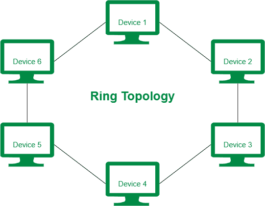
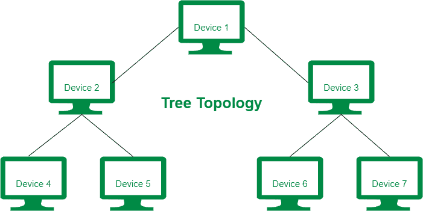

# 环形拓扑和树形拓扑的区别

> 原文:[https://www . geesforgeks . org/环拓扑和树拓扑的区别/](https://www.geeksforgeeks.org/difference-between-ring-topology-and-tree-topology/)

**1。环形拓扑:**
环形拓扑是一种类型的[网络拓扑](https://www.geeksforgeeks.org/types-of-network-topology/)，其中每个设备都连接到特定的两个分支，这两个分支以圆形或环形方式连接到设备。环形拓扑不太可靠，因为一个设备的故障会干扰整个网络。环形拓扑比树形拓扑便宜。

**2。树形拓扑:**
树形拓扑是一种网络拓扑，其中设备以树的形式组织。在树形拓扑中，分支电缆没有连接根节点和所有其他通信节点的环路，从而形成了一个层次结构。树形拓扑更昂贵，因为它布线密集。

环形拓扑和树形拓扑的区别如下:

| 没有。 | 环形拓扑 | 树形布局 |
| --- | --- | --- |
| 1. | 在环形拓扑中，每个设备都连接到专门连接到设备的两个分支。 | 在树形拓扑中，设备以树的形式组织。 |
| 2. | 环形拓扑不如树形拓扑可靠。 | 树形拓扑更可靠，因为一个设备的故障不会干扰整个网络。 |
| 3. | 环形拓扑所需的电缆数量比树形拓扑少得多。 | 树形拓扑所需的电缆数量高于环形拓扑。 |
| 4. | 环形拓扑通常适用于局域网。 | 广域网采用树形拓扑。 |
| 5. | 环形拓扑的安全性较低。 | 而树型拓扑的安全性很高。 |
| 6. | 环形拓扑的成本低于树形拓扑。 | 与环形拓扑相比，树形拓扑的成本较高。 |

