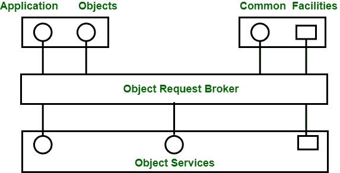

# RMI 和 CORBA 的区别

> 原文:[https://www . geeksforgeeks . org/区分-RMI-和-corba/](https://www.geeksforgeeks.org/difference-between-rmi-and-corba/)

**1。远程方法调用(RMI) :**
RMI 应用程序提供两个独立的程序，一个 **[服务器](https://www.geeksforgeeks.org/introduction-of-server/)** 和一个**客户端**。有些任务由服务器程序执行，即创建一些远程对象，引用这些对象，并等待客户机调用这些对象上的方法。客户端程序获取对服务器上一个或多个远程对象的远程引用，并调用这些对象上的方法。基本上，RMI 提供了一种机制，通过这种机制，服务器和客户端可以相互通信和传递信息。RMI 由**三层**组成:

*   存根/骨架层
*   远程参考层
*   传输层

这些层之间的关系如下图所示:

图–马绍尔架构

**2。[通用对象请求代理架构(CORBA)](https://www.geeksforgeeks.org/client-server-software-development-introduction-to-common-object-request-broker-architecture-corba/) :**
它是对象管理组开发的标准，用于提供分布式对象之间的互操作性。它是世界领先的中间件解决方案。它支持信息、独立硬件平台、编程语言和操作系统的交换。它通常被定义为“软件总线”，因为它是一个基于软件的通信接口，通过它可以定位和访问对象。

图–CORBA 体系结构

**RMI 和 CORBA 的区别:**

| 无线电磁指示器（Radio Magnetic Indicator 的缩写） | 公共对象请求代理结构（同 Common Object Request Breaker Architecture） |
| --- | --- |
| RMI 是一种特定于 Java 的技术。 | CORBA 对许多语言都有实现。 |
| 它使用 Java 接口进行实现。 | 它使用接口定义语言(IDL)将接口与实现分开。 |
| RMI 对象是自动垃圾收集的。 | CORBA 对象不被垃圾收集，因为它是独立于语言的，而且像 C++这样的一些语言不支持垃圾收集。 |
| RMI 程序可以从远程 JVM 下载新的类。 | CORBA 不支持这种代码共享机制。 |
| RMI 通过远程引用或值传递对象。 | CORBA 通过引用传递对象。 |
| Java RMI 是一个以服务器为中心的模型。 | CORBA 是一个对等系统。 |
| RMI 使用 Java 远程方法协议作为其底层远程处理协议。 | CORBA 使用互联网 ORB 间协议作为其底层远程处理协议。 |
| 定位对象实现的责任落在了 JVM 身上。 | 定位对象实现的责任落在对象适配器(基本对象适配器或可移植对象适配器)上。 |

