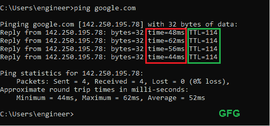

# 往返时间(RTT)和生存时间(TTL)之差

> 原文:[https://www . geesforgeks . org/往返时间-rtt 和生存时间-ttl 之差/](https://www.geeksforgeeks.org/difference-between-round-trip-time-rtt-and-time-to-live-ttl/)

**1。** [**【往返时间(RTT)**](https://www.geeksforgeeks.org/what-is-rttround-trip-time/) **:**
数据包发送到目的地所用的时间长度，包括在始发地点收到该数据包的确认所用的时间。


显示 RTT 的图像

**2。生存时间(TTL) :**
正在发送的数据的生命周期或生存时间。一旦指定时间结束或过去，数据将被丢弃。
或者也可以表示为分组被设置为存在于网络中的跳数，之后该分组被丢弃。TTL 字段的目的是避免无法传送的数据报在网络中不断循环的情况。

#### **往返时间与生存时间的差异:**

<figure class="table">

| 

#### 序列号

 | 

#### **Round trip time**

 | 

#### **Survival time**

 |
| one | 也称为 ping 时间。 | 也称为跳跃极限。 |
| Two | 给出发送数据包和从目的地得到确认所花费的总时间。 | 给出在网络路径中传输的跳数限制。在该限制之后，该分组将被丢弃。 |
| three | 它对于确定本地网络或更大的互联网网络上的连接很重要，用于诊断网络连接的速度和可靠性。 | 帮助我们防止数据包在路由器路径中无限循环。 |
| four | 往返时间不会存储在任何地方，它将在确认来自目的地时计算。 | 它是一个存储在 IP 报头中的 8 位字段。 |
| five | 它可以是任何值，因为它取决于许多因素。 | 可以设置为 TTL 的最大值是 255，因为这是我们可以用 8 位产生的最大值。 |
| six | 这取决于许多因素，如距离、跳数、服务器响应时间等。 | 这取决于系统，最初由发送数据包的系统设置。 |
| seven | RTT 是以毫秒为单位测量的。 | TTL 以秒为单位。 |

</figure>

### 如何找到 RTT 和 TTL？

#### 例 1。平宁 Amazon.com

我们可以使用 ping 命令找到 RTT 和 TTL。打开您的终端或命令提示符，键入以下命令查看 RTT 和 TTL 到 Amazon.com

```
ping amazon.com
```

你会看到类似这样的屏幕。


以单词 reply 开头的每一行都是从服务器到客户端对发送的数据包的回复，在上面的例子中，我们得到了 4 个回复，这意味着我们发送了 4 个数据包。
标有**红色**框的数值为 **RTT(往返时间)**由于是以毫秒
计量的，所以以**毫秒**显示，标有**蓝色**框的数值为 **TTL(生存时间)**以**秒计量。**

因此，ping 以上的平均 RTT 为(230+231+236+230) / 4 = **231.75 毫秒**
ping 以上的 TTL 为 **235 秒**或 **235 跳**

#### 例 2。平宁 google.com

在下面指挥的帮助下平定了 google.com

```
ping google.com
```

运行上述命令后，您将看到类似于此的屏幕



平宁 google.com

所以平均 RTT 对于以上 ping 是(48+62+56+44)/4 =**52.5 ms**
以上 ping 的 TTL 是 **114 秒**或者 **114 跳。**