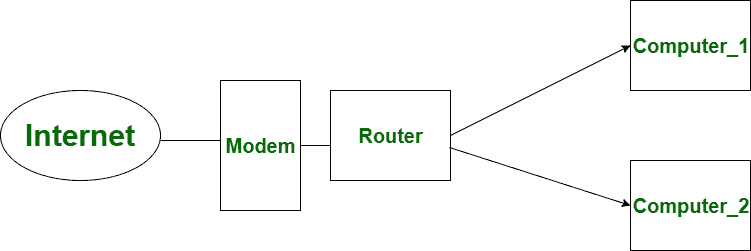

# 路由器和防火墙的区别

> 原文:[https://www . geesforgeks . org/路由器和防火墙的区别/](https://www.geeksforgeeks.org/difference-between-router-and-firewall/)

**[路由器](https://www.geeksforgeeks.org/network-devices-hub-repeater-bridge-switch-router-gateways/) :**
路由器被称为网络中的连接设备。它用于为数据包选择最短的路由，以实现其目标。路由器的主要目的是同时连接不同的网络。像防火墙一样，它也在网络层工作，但也在物理层和开放系统互连模型的数据链路层工作。与防火墙不同，它在路由网络之前不包括加密。路由器不能保护网络免受威胁，但它包含了在网络之间共享互联网连接的共享条款。

**[防火墙](https://www.geeksforgeeks.org/introduction-of-firewall-in-computer-network/) :**
防火墙是路由器的指定版本。所有进入或丢弃网络的数据包都要通过防火墙，并检查防火墙是否允许。所有流量都必须通过防火墙，只有授权的流量才能通过。防火墙必须强大。它是位于两个网络之间的系统，在这两个网络之间实施访问控制策略。和路由器一样，它也在 OSI 模型的网络层工作。与路由器不同，防火墙在传输前使用加密对数据进行加密。防火墙不共享网络，但它包括保护措施，以保护网络免受威胁。

让我们看看路由器和防火墙的区别:

| S.NO | 防火墙 | 路由器 |
| --- | --- | --- |
| 1. | 防火墙检查来自传入数据包的威胁。 | 路由器是同时连接各种网络的一种方式。 |
| 2. | 防火墙工作在开放系统互连模型的网络层和传输层。 | 而路由器工作在 OSI(开放系统互连)模型的物理层、网络层和数据链路层。 |
| 3. | 防火墙在传输数据之前使用加密。 | 而路由器不使用加密。 |
| 4. | 防火墙不能共享网络。 | 而路由器在网络之间共享互联网连接。 |
| 5. | 路由器内部可能存在防火墙。 | 而路由器可能不在防火墙内。 |
| 6. | 防火墙过滤和管理数据。 | 而路由器管理到达所需目标的流量。 |
| 7. | 防火墙维护状态表，该表提供关于流状态的信息。 | 而路由器不维护任何流状态信息的状态表。 |
| 8. | 防火墙一般用于计算机核心网络的保护。 | 路由器一般用于广域网链路的路由和终结。 |