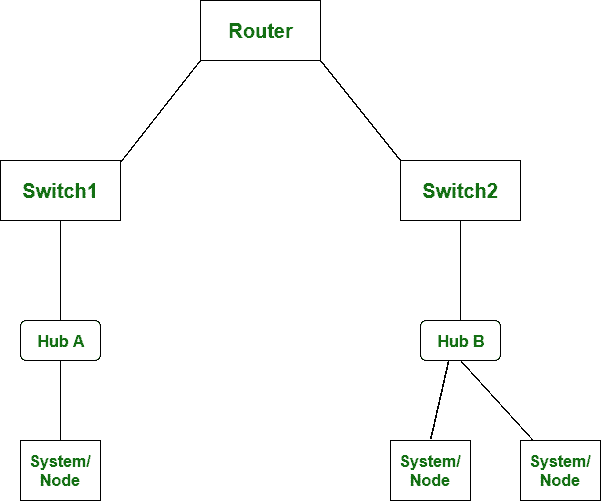

# 路由器和交换机的区别

> 原文:[https://www . geesforgeks . org/路由器和交换机的区别/](https://www.geeksforgeeks.org/difference-between-router-and-switch/)

先决条件–[网络设备](https://www.geeksforgeeks.org/network-devices-hub-repeater-bridge-switch-router-gateways/)
**路由器**和**交换机**都是网络中的连接设备。路由器被用来确定数据包到达目的地的最小路径。

路由器的主要目标是同时连接各种网络，工作在网络层，而交换机的主要目标是同时连接各种设备，工作在数据链路层。

让我们看看路由器和交换机的区别:

<figure class="table">

| 不，先生。 | 路由器 | 转换 |
| --- | --- | --- |
| 1. | 路由器的主要目标是同时连接各种网络。 | 而交换机的主要目标是同时连接各种设备。 |
| 2. | 它在网络层工作。 | 当它在数据链路层工作时。 |
| 3. | 局域网和城域网都使用路由器。 | 而交换机仅由局域网使用。 |
| 4. | 通过路由器，数据以数据包的形式发送。 | 而通过交换机，数据以数据包和帧的形式发送。 |
| 5. | 路由器中发生冲突较少。 | 而全双工交换中没有冲突发生。 |
| 6. | 路由器兼容 NAT。 | 而它与 NAT 不兼容。 |
| 7. | 路由的类型有:自适应路由和非自适应路由。 | 交换的类型有:电路交换、分组交换和消息交换。 |

</figure>