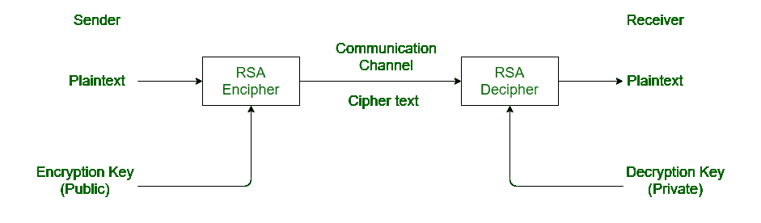
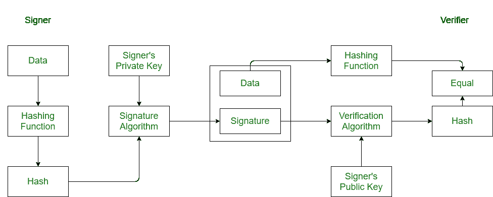

# RSA 算法与 DSA 的区别

> 原文:[https://www . geeksforgeeks . org/RSA 算法与 dsa 的区别/](https://www.geeksforgeeks.org/difference-between-rsa-algorithm-and-dsa/)

**1。Rivest-Shamir-Adleman (RSA)算法:**T2【RSA】代表 **Rivest-Shamir-Adleman** 。它是一种用于安全数据传输的密码系统。在 RSA 算法中，加密密钥是公共的，而解密密钥是私有的。该算法是基于这样一个数学事实，即分解两个大素数的乘积并不容易。它是由**罗恩·瑞文斯特****阿迪·萨莫尔**和**伦纳德·阿德曼**在 1977 年开发的。

**2。数字签名算法(DSA) :**
DSA 代表**数字签名算法**。它用于数字签名及其验证。它基于模幂和离散对数的数学概念。由**国家标准技术研究院(NIST)** 于 1991 年开发。
涉及四个操作:

1.  密钥生成
2.  密钥分发
3.  签署
4.  签名验证

**RSA 算法与 DSA 的区别:**

| 南非共和国(Republic of South Africa) | 目录系统代理(Directory System Agent) |
| --- | --- |
| 它是一种密码算法。 | 它是数字签名算法。 |
| 它用于安全的数据传输。 | 它用于数字签名及其验证。 |
| 它是在 1977 年开发的。 | 而它是在 1991 年开发的。 |
| 由**罗恩·瑞文斯特****阿迪·萨莫尔**和**伦纳德·阿德曼**开发。 | 由**国家标准技术研究院(NIST)** 开发。 |
| 它使用两个大素数乘积因式分解的数学概念。 | 它使用模幂运算和离散对数。 |
| 密钥生成速度较慢。 | 而与 RSA 相比，它在密钥生成方面更快。 |
| 它在加密方面比 DSA 更快。 | 而加密速度较慢。 |
| 解密比较慢。 | 虽然解密速度更快。 |
| 它最适合验证和加密。 | 它最适合登录和解密。 |

