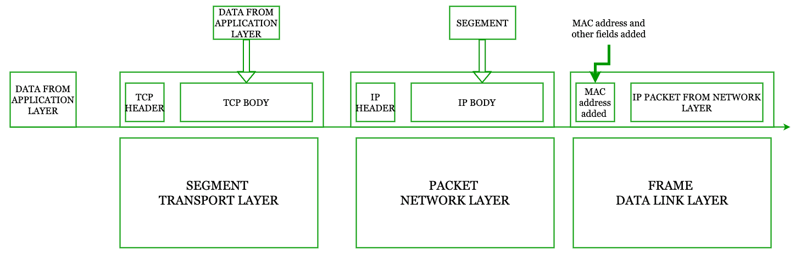

# 段、包和帧之间的差异

> 原文:[https://www . geesforgeks . org/段间差异-数据包和帧/](https://www.geeksforgeeks.org/difference-between-segments-packets-and-frames/)

在这篇文章中，我们了解了在计算机网络中经常被误用的术语和这些术语的用法之间的确切区别。

在开始之前，最好熟悉一个叫做**协议数据单元**的术语。
术语“分组数据单元”用于指代现场视察模型不同层中的数据包。因此，分组数据单元给出了数据包的抽象概念。PDU 在不同的层中有不同的含义，但我们仍然可以把它作为一个通用术语。

给出一个清晰的画面:-

1.  传输层的协议数据单元称为段。
2.  网络层的协议数据单元称为数据包。
3.  数据链路层的协议数据单元称为帧。

这是计算机网络中使用的不同术语的基本含义。

[应用层](https://www.geeksforgeeks.org/protocols-application-layer/)可以给底层任意数量的数据，但不可能把应用层给的数据全部发送出去直接发送。于是，TCP 就出现了。TCP 有助于将数据(由应用层给出)分解为给定网络可以处理的最大分段大小，这样路由器中就不会出现进一步的碎片。

并且这个 TCP 还负责当数据段被传送时的确认。

**1。段:**
来自应用层的数据按照网络的 MSS 分成更小的部分，TCP 报头被添加到更小的部分。集管的尺寸可以从 20B 到 60B 变化。但是通常，头部的尺寸是 20B(其余 40B 是可选的)

TCP 的[报头包括:-](https://www.geeksforgeeks.org/services-and-segment-structure-in-tcp/)

```
1. Source Port
2. Destination Port
3. Flag bits (like DF, MF, etc)
4. Sequence Number of the Segments
5. Checksum
6. Options Field 
```

源端口和目的端口是必需的，因为它告知在接收主机中要传送哪个分组数据单元。

通过考虑 TCP 报头、数据和 IP 伪报头来计算 TCP 的校验和字段。校验和确保发送和接收正确的数据。

因此，在所有这些处理之后，被破坏的数据包被称为数据段。

**2。数据包:**
从传输层接收的数据段被进一步处理以形成数据包。

该 IP 分组具有从 20B 到 60B 的不同大小的报头。但通常是 20B。

IP 报头有许多字段，即:-

```
1. Source IP Address
2. Destination IP Address
3. TTL(time to leave)
4. Identification
5. Protocol type 
6. Version (version of protocol)
7. Options 
```

现在让我们理解这个概念，IP 主体包含从[传输层](https://www.geeksforgeeks.org/transport-layer-responsibilities/)接收的段，没有任何修改。在 IP 正文中，添加了具有上述字段的 IP 头。

IP 报头随着网络中的数据包不断修改，因为 TTL 会随着每一跳不断变化。

因此，IP 报头和主体(包含来自传输层的数据段)一起构成了 IP 数据包，或者通常只构成数据包。

当网络的 MTU 较少时，如果需要，该层还负责分片。这种分片是在路由器上完成的。

**3。帧:**
从网络层接收的数据包被进一步处理以形成帧。

这里是[数据链路层](https://www.geeksforgeeks.org/data-link-layer-in-osi-model/)添加了表头，表头由字段组成。

```
1. Source Mac Address
2. Destination Mac Address
3. Data
4. Length
5. Checksum (CRC) 
```

使用[地址解析协议](https://www.geeksforgeeks.org/how-address-resolution-protocol-arp-works/)解析源[媒体访问控制地址](https://www.geeksforgeeks.org/introduction-of-mac-address-in-computer-network/)。当帧在网络中移动时，源和目的地的媒体访问控制地址会不断修改。

媒体访问控制地址的修改是由路由器完成的。

数据是从网络层接收的数据段。

长度是网络的总 MTU(最大可传输单位)。

通过下面给出的图表，所有概念都将变得清晰。

