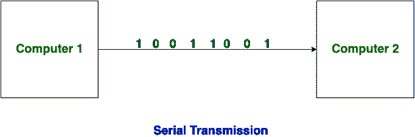
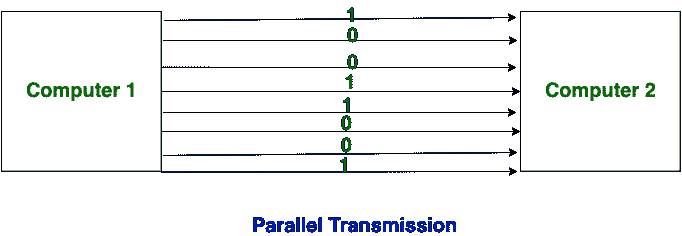

# 串行和并行传输的区别

> 原文:[https://www . geesforgeks . org/串并传输的区别/](https://www.geeksforgeeks.org/difference-between-serial-and-parallel-transmission/)

在计算机之间传输数据有两种方法，下面给出:串行传输和并行传输。

**串行传输:**
在串行传输中，数据位从一台计算机双向传输到另一台计算机。在这种传输中，一个位在一个时钟脉冲下流动。在串行传输中，一次传输 8 位，有一个开始位和一个停止位。

**并行传输:**
在并行传输中，许多位同时从一台计算机流向另一台计算机。并行传输比串行传输传输比特更快。短距离使用平行传输。

**串行和并行传输的区别:**

<figure class="table">

| S.NO | 

连续传输

 | 

并行传输

 |
| --- | --- | --- |
| 1. | 在串行传输中，数据(位)双向流动。 | 在并行传输中，数据在多条线路上流动。 |
| 2. | 串行传输具有成本效益。 | 并行传输不具成本效益。 |
| 3. | 在串行传输中，一个时钟脉冲传输一位。 | 在并行传输中，一个时钟脉冲传输八位。 |
| 4. | 串行传输比并行传输慢。 | 与串行传输相比，并行传输更快。 |
| 5. | 通常，串行传输用于长距离传输。 | 一般来说，短距离使用平行传输。 |
| 6. | 串行传输中使用的电路简单。 | 并行传输中使用的电路相对复杂。 |

</figure>