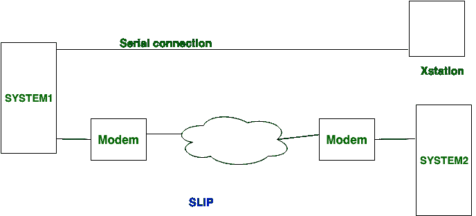
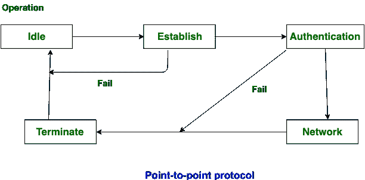

# 串行线路互联网协议(SLIP)和点对点协议(PPP)的区别

> 原文:[https://www . geesforgeks . org/serial-line-internet-protocol-slip-点对点协议-ppp/](https://www.geeksforgeeks.org/difference-between-serial-line-internet-protocol-slip-and-point-to-point-protocol-ppp/)

**串行线路互联网协议(SLIP)** 和**点对点协议(PPP)** 的主要区别在于串行线路互联网协议是点对点协议的前身协议。另一方面，点对点协议是串行线路互联网协议的后继协议。

让我们看看 SLIP 和 PPP 之间区别:

| S.NO | 串行线路接口协议ˌ是旧式的协议(Serial Line Interface Protocol) | 巴基斯坦人民党 |
| 1. | SLIP 代表串行线路互联网协议。 | PPP 代表点对点协议。 |
| 2. | SLIP 是 PPP 的前身协议。 | 而它是 SLIP 的后继协议。 |
| 3. | SLIP 涵盖了互联网协议数据包。 | 当它覆盖数据报时。 |
| 4. | SLIP 不提供身份验证。 | 而 PPP 则提供认证。 |
| 5. | 从 SLIP 导出的协议是压缩 SLIP。 | 而 PPP 衍生的协议是以太网 PPP 和 and PPP。 |
| 6. | SLIP 是一个静态的 IP 地址分配。 | 而它是一个动态的 IP 地址分配。 |
| 7. | 在 SLIP 中，数据以同步形式传输。 | 在这种情况下，数据以同步和异步形式传输。 |