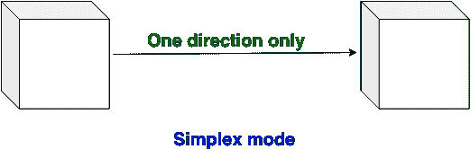
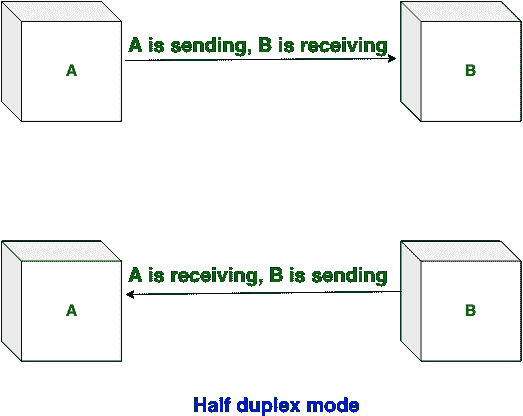
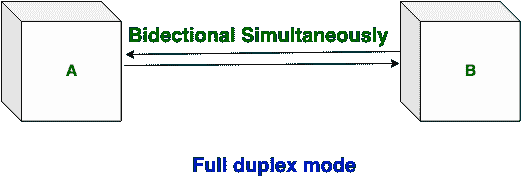

# 单工、半双工和全双工传输模式的区别

> 原文:[https://www . geeksforgeeks . org/单工-半双工和全双工传输模式的区别/](https://www.geeksforgeeks.org/difference-between-simplex-half-duplex-and-full-duplex-transmission-modes/)

先决条件–[计算机网络中的传输模式](https://www.geeksforgeeks.org/transmission-modes-computer-networks/)
有 3 种传输模式，如下所示:单工模式、半双工模式和全双工模式。这些解释如下。

1.  **Simplex mode:**
    In simplex mode, Sender can send the data but that sender can’t receive the data. It is a unidirectional communication.

    

2.  **半双工模式:**
    在半双工模式下，发送方可以发送数据，也可以接收数据，但一次只能接收一个数据。这是双向通信，但一次只能有一个。

6.  **Full duplex mode:**
    In full duplex mode, Sender can send the data and also can receive the data simultaneously. It is two-way directional communication simultaneously.

    

**单工、半双工和全双工传输模式的区别:**

| 单一的 | 半双工 | 全双工 |
| 单工模式是单向通信。 | 半双工模式是双向通信，但一次只能进行一次。 | 全双工模式同时是双向通信。 |
| 在单工模式下，发送方可以发送数据，但不能接收数据。 | 在半双工模式下，发送方可以发送数据，也可以一次只接收一个数据。 | 在全双工模式下，发送方可以发送数据，也可以同时接收数据。 |
| 单工模式提供的性能不如半双工和全双工。 | 半双工模式提供的性能低于全双工模式。 | 全双工比单工和半双工模式提供更好的性能。 |
| 单工模式例子有:键盘和显示器。 | 半双工模式的例子是:对讲机。 | 全双工模式的例子是:电话。 |