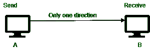
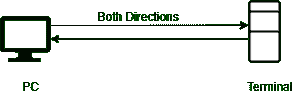

# 单工传输模式和全双工传输模式的区别

> 原文:[https://www . geesforgeks . org/单工传输模式和全双工传输模式的区别/](https://www.geeksforgeeks.org/difference-between-simplex-transmission-modes-and-full-duplex-transmission-modes/)

先决条件–[计算机网络中的传输模式](https://www.geeksforgeeks.org/transmission-modes-computer-networks/)

**1。单工模式:**
单工模式就像在单行道上一样，通信是单向的，就像在单行道上一样。在这种情况下，链路上的两个设备中只有一个可以传输，另一个只能接收。这种模式是利用信道的全部容量向一个方向发送数据。

**2。全双工模式:**
全双工模式是指发送方可以发送数据，也可以同时接收数据。它是双向的，即同时双向通信。

**单工传输模式和全双工传输模式的区别:**

<figure class="table">

| **先生号** | **单工模式** | **全双工模式** |
| 1. | 发送方可以发送数据，但不能接收数据。 | 发送者可以同时发送和接收数据。 |
| 2. | 在单工模式下，数据流是单向的。 | 在全双工模式下，数据流是双向的，并且是同时的。 |
| 3. | 单工模式的性能比全双工模式差。 | 全双工比单工模式提供更好的性能。 |
| 4. | 在这种情况下，带宽利用率最高。 | 在这种情况下，带宽利用率提高了一倍。 |
| 5. | 在这种情况下，一个站是发射机，另一个是接收机。在这里，信息是一种方式，即只有发送器发送数据或信息。 | 在这种情况下，信号是双向传输的；两个终端站可以同时接收和发送数据。全双工模式需要两个独立的传输通道，一个用于接收数据，另一个用于传输数据。 |
| 6. | 键盘和传统显示器是单工模式的例子。 | 电话、即时聊天室、音频视频通话都是全双工模式的例子。 |

</figure>