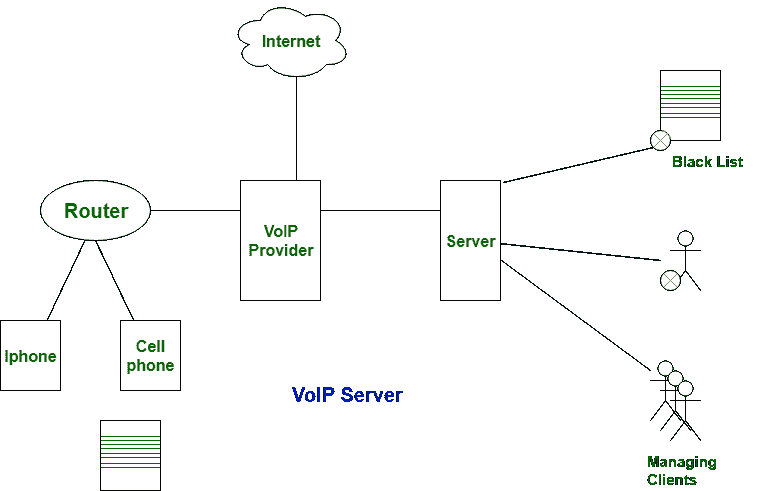

# SIP 和 VoIP 的区别

> 原文:[https://www . geesforgeks . org/sip 和 voip 的区别/](https://www.geeksforgeeks.org/difference-between-sip-and-voip/)

**SIP** 代表**会话发起协议**和 **VoIP** 代表**基于 IP 的语音**区域单元，该技术负责批准任何类型的网络通信。然而，网络电话(网络电话)单独用于网络电信，而会话发起协议(会话发起协议)是处理传输交换的协议。更具体地说，会话发起协议信令协议得益于网络电话或网络电信的标准化。

会话发起协议被用来排列网络电话呼叫、视频会议和替代传输连接。另一方面，发声 IP 被用来通过信息网络传输语音流量。

让我们看看 SIP 和 VoIP 协议之间的区别，下面以表格形式给出:

| S.NO | 啜饮 | （同 VoiceoverInternetProtocol）网络电话 |
| --- | --- | --- |
| 1. | SIP 代表会话发起协议。 | 而网络电话代表网络电话。 |
| 2. | SIP 可以处理所有类型的媒体。 | 同时它可以处理语音通话和信息。 |
| 3. | SIP 更灵活。 | 虽然它有点灵活。 |
| 4. | SIP 不依赖于任何其他设备。 | 但这取决于提供互联网设备。 |
| 5. | 它是应用层的协议。 | 而它是第 3 层网络协议。 |
| 6. | 操纵技术与信令协议有关。 | 而它与单独的和各自显著的技术有关。 |
| 7. | 它与互联网兼容。 | 同时也兼容互联网。 |
| 8. | SIP 分别使用不同的系统来处理完全不同的操作。 | 而它只使用特定的系统来处理整个操作。 |