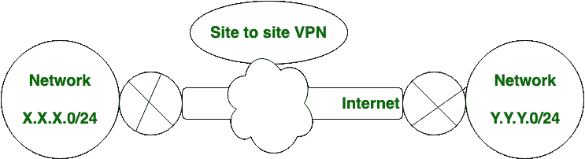
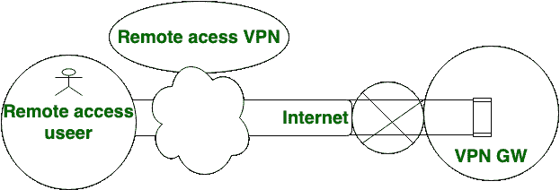

# 站点到站点 VPN 和远程访问 VPN 的区别

> 原文:[https://www . geesforgeks . org/站点间 vpn 和远程访问 vpn 的区别/](https://www.geeksforgeeks.org/difference-between-site-to-site-vpn-and-remote-access-vpn/)

**站点到站点 VPN** 和**远程访问 VPN** 都是代表**虚拟专用网络的 VPN 类型。**

**站点到站点 VPN** 也称为路由器到路由器 VPN。在站点到站点的虚拟专用网络中，IPsec 安全方法用于创建从一个客户网络到客户远程站点的加密隧道。站点到站点虚拟专用网中不允许多个用户。

在**远程访问虚拟专用网络**中，个人用户连接到专用网络，它允许该技术远程访问该专用网络的服务和资源。它最适合企业和家庭用户。在远程访问 VPN 中，允许多个用户。

让我们看看站点到站点 vpn 和远程访问 vpn 之间的区别，如下所示:

| S.NO | 站点到站点虚拟专用网 | 远程访问虚拟专用网 |
| 1. | 在站点到站点的虚拟专用网络中，IPsec 安全方法用于创建从一个客户网络到客户远程站点的加密隧道。 | 在远程访问虚拟专用网络中，个人用户连接到专用网络。 |
| 2. | 站点到站点的虚拟专用网不需要在每个客户端上设置。 | 远程访问虚拟专用网可能需要也可能不需要在每个客户端上设置。 |
| 3. | 站点到站点的虚拟专用网不需要每个用户都启动虚拟专用网隧道设置。 | 远程访问虚拟专用网要求每个远程访问用户启动虚拟专用网隧道设置。 |
| 4. | 站点到站点 VPN 支持 IPsec 技术。 | 而远程访问 VPN 支持 SSL 和 IPsec 技术。 |
| 5. | 在站点到站点 VPN 中，不允许多个用户。 | 在远程访问 VPN 中，允许多个用户。 |

