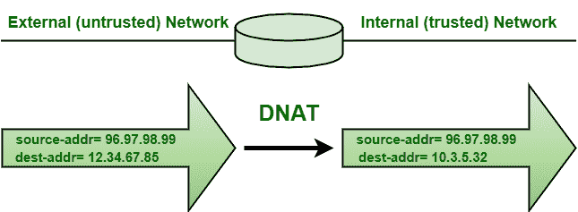

# SNAT 和 DNAT 的区别

> 原文:[https://www . geesforgeks . org/difference-snat-and-dnat/](https://www.geeksforgeeks.org/difference-between-snat-and-dnat/)

**1。源网络地址转换(SNAT) :**
SNAT，顾名思义，是从私有 IP 地址连接到公共 IP 地址时，一般将源 IP 地址进行转换的技术。它将请求中的源客户端 IP 地址映射到 BIG-IP 设备上定义的转换。当内部主机需要启动与外部主机或公共主机的会话时，这是最常见的 NAT 形式。

**2。目的网络地址转换(DNAT) :**
DNAT，顾名思义，是一种将目的 IP 地址一般从公共 IP 地址转换为私有 IP 地址时进行转换的技术。它通常用于将一台主机上发往特定 IP 地址或 IP 地址上特定端口的数据包重定向到不同的地址，主要是在不同的主机上。

**SNAT 和 DNAT 的区别:**

<figure class="table">

| 

**的名称**

 | 

**DNA**

 |
| --- | --- |
| 它通常用于将私有地址或端口更改为离开网络的数据包的公共地址或端口。 | 它通常用于将目的地为公共地址或端口的传入数据包重定向到网络内部的私有 IP 地址或端口。 |
| 它将连接中的源 IP 地址转换为一个人定义的大 IP 系统 IP 地址。 | 它将受设备保护的内部服务器的 IP 地址转换为公共 IP 地址。 |
| 它用于更改数据包的源地址。 | 它用于更改数据包的目的地址。 |
| 它还改变了 TCP/UDP 报头中的源端口。 | 它还会更改 TCP/UDP 报头中的目标端口。 |
| 它通常允许内部的多个主机访问外部的任何主机。 | 它通常允许外部的多个主机进入内部的单个主机。 |
| 它是在路由决定做出后执行的。 | 它是在路由决定做出之前执行的。 |
| 在这种情况下，目的地 IP 地址被保持，而源 IP 地址被改变。 | 在这种情况下，源 IP 地址被保持，而目的 IP 地址被改变。 |
| 局域网内和防火墙后的客户端需要浏览互联网。 | 网站托管在防火墙后的数据中心内，用户需要通过互联网访问 |

</figure>