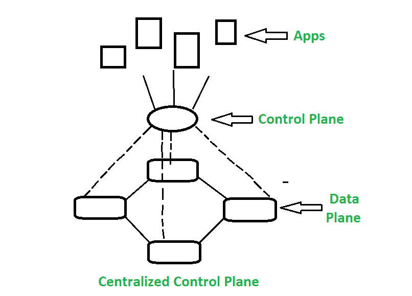
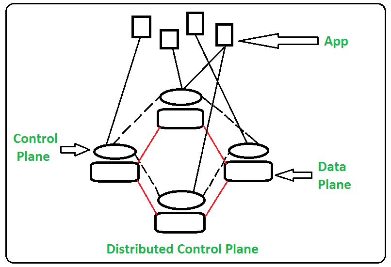

# 软件定义网络与传统网络的区别

> 原文:[https://www . geesforgeks . org/软件定义网络与传统网络的区别/](https://www.geeksforgeeks.org/difference-between-software-defined-network-and-traditional-network/)

**1。[软件定义网络(SDN)](https://www.geeksforgeeks.org/software-defined-networking/) :**
SDN 代表软件定义网络，是一种网络架构方式。它支持使用软件应用程序控制和管理网络。通过软件定义网络(SDN)，整个网络及其设备的联网行为通过使用开放 API 的软件应用程序以集中控制的方式进行编程。

软件定义网络通过网络虚拟化提高性能。在软件开发网络中，软件控制的应用程序或应用程序接口作为完整网络管理的基础，可以引导网络上的流量或与底层硬件基础设施通信。简单来说，我们可以说 SDN 可以创建虚拟网络，也可以借助软件控制传统网络。

下图说明了**架构软件定义网络:**

软件定义的网络

**2。传统网络:**
传统网络是指使用固定和专用的硬件设备，如[路由器和交换机](https://www.geeksforgeeks.org/network-devices-hub-repeater-bridge-switch-router-gateways/)来控制网络流量的传统网络方式。在当前不断增长的业务形势下，无法扩展以及网络安全和性能是当前主要关注的问题，因此 SDN 正在控制传统网络。传统网络是静态的，基于硬件网络设备。

传统的网络体系结构直到最近几年才被许多公司使用，但是由于其缺点，软件定义网络已经得到了发展，并且在未来几年将被更多地使用。

下图说明了传统网络的**架构:**

传统网络架构

**SDN 与传统网络的区别:**

| 没有。 | 软件定义网络(Software Defined Network) | 传统网络 |
| 01. | 软件定义网络是一种虚拟网络方法。 | 传统网络是旧的传统网络方式。 |
| 02. | 软件定义网络是集中控制。 | 传统网络是分布式控制。 |
| 03. | 这个网络是可编程的。 | 这个网络是不可编程的。 |
| 04. | 软件定义网络是开放接口。 | 传统网络是封闭接口。 |
| 05. | 在软件定义网络中，数据平面和控制平面由软件解耦。 | 在传统网络中，数据平面和控制平面安装在同一平面上。 |
| 06. | 它支持自动配置，因此花费的时间更少。 | 它支持静态/手动配置，因此需要更多时间。 |
| 07. | 它可以区分特定网络数据包的优先级并阻止它们。 | 它以同样的方式引导所有数据包，不支持优先级排序。 |
| 08. | 根据需要编程很容易。 | 很难再次编程，也很难根据使用情况替换现有程序。 |
| 09. | 软件定义网络的成本很低。 | 传统网络成本高。 |
| 10. | 软件定义网络的结构复杂性较低。 | 传统网络结构复杂度高。 |
| 11. | 软件定义网络的可扩展性很高。 | 传统网络扩展性低。 |
| 12. | 在 SDN 中，由于是集中控制的，因此很容易进行故障排除和报告。 | 在传统网络中，由于是分布式控制的，很难进行故障排除和报告。 |
| 13. | 其维护成本低于传统网络。 | 传统网络维护成本高于 SDN。 |

