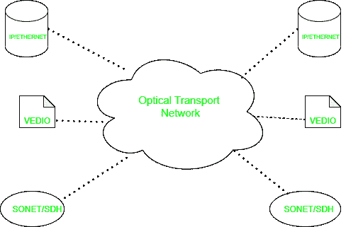

# 【SONET 和 OTN 的区别

> 原文:[https://www . geesforgeks . org/SONET 和-otn 之间的差异/](https://www.geeksforgeeks.org/difference-between-sonet-and-otn/)

**1。[同步光网络(SONET)](https://www.geeksforgeeks.org/synchronous-optical-network-sonet/) :**
SONET 代表同步光网络。这是一种由 Bellcore 开发的通信协议，用于通过使用光纤在相对较大的距离上传输大量数据。通过使用这种方法，可以通过光纤同时传输多个数字数据流。

**2。光传送网(OTN) :**
OTN 代表光传送网。这是一种通过光纤网络发送网络消息的协议。它旨在通过提供一个透明的框架来有效地承载不同的流量类型，从而解决这些问题。形成了两层交换(时分复用和 WSON)，并定义了传输、管理、监督、复用、路由和生存性功能。

**SONET 和 OTN 的区别:**

| 没有。 | 同步光纤网(Synchronous Optical Network) | OTN |
| 1. | 有效载荷的同步绘图。 | 有效载荷的异步映射。 |
| 2. | 它被设计成在多波长下工作。 | 它被设计成在多波长(DWDM)下工作。 |
| 3. | 它需要在整个网络中进行正确的时序分配。 | 它不需要时序分布。 |
| 4. | 它是用固定的帧速率定义的。 | 它是用固定的框架尺寸定义的。 |
| 5. | 它的效率不如 OTN。 | 它比 SONET 效率高得多。 |
| 6. | 它执行多级多路复用。 | 它执行单级多路复用。 |
| 7. | 它可以扩展到最大 40Gb/s。 | 它可以扩展到 100Gb/s(或更高)。 |
| 8. | 它没有任何标准的 FEC。 | 它具有纠错的前向纠错大小，每帧纠正 16 个块。 |

