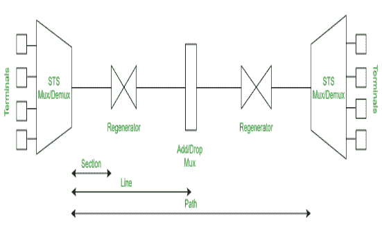

# 【SONET 和 SDH 的区别

> 原文:[https://www . geeksforgeeks . org/SONET 和-sdh 的区别/](https://www.geeksforgeeks.org/difference-between-sonet-and-sdh/)

**1。[同步光网络(SONET)](https://www.geeksforgeeks.org/synchronous-optical-network-sonet/) :**
SONET 代表同步光网络。它是由 Bellcore 开发的一种通信协议，用于通过使用光纤在相对较大的距离上传输大量数据。通过 SONET，多个数字数据流通过光纤同时传输。

**2。[同步数字体系(SDH)](https://www.geeksforgeeks.org/sdh-full-form/) :**
SDH 代表同步数字体系，定义为电信中使用的复用技术。国际上使用的是同步光网络。据说它是 SONET 的变种，被认为等同于 SDH。它的特性建立在高阶复用的基础上。这些技术提供了比代表准同步数字体系的 PDH 更快、更低价格的网络互连。

**SONET 和 SDH 的区别:**

| 没有。 | 同步光纤网(Synchronous Optical Network) | 同步数字系列 |
| 1. | SONET 代表同步光网络。 | SDH 代表同步数字体系。 |
| 2. | 它是用于光传输的数字层次接口。 | 它是辅助 BISDN 的网络节点接口、用户-网络接口和 U 参考点接口。 |
| 3. | 它是由美国国家标准协会开发的。 | 它是由国际电信联盟-电信标准化部门开发的。 |
| 4. | 它的总传输开销为 9×3 = 27 字节。 | 它的总传输开销为 9×9 = 81 字节。 |
| 5. | 它只能以同步模式传输数据。 | 它可以在同步模式和异步模式下传输。 |
| 6. | 与 SDH 相比，它不能提供更好的传输速率。 | 与 SONET 相比，它提供了更好的传输速率。 |

