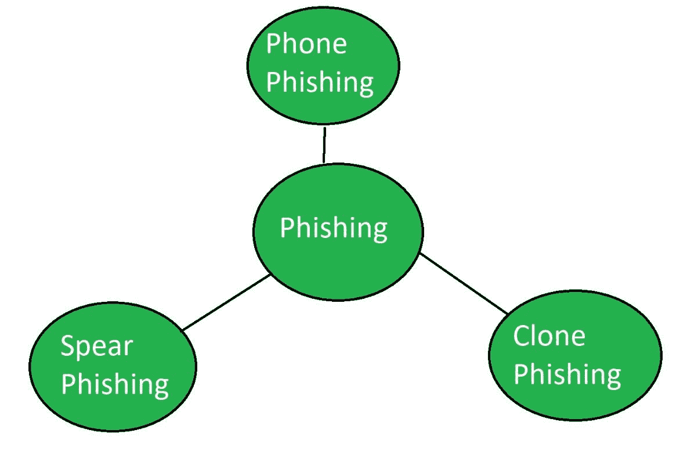

# 欺骗和钓鱼的区别

> 原文:[https://www . geesforgeks . org/欺骗和网络钓鱼的区别/](https://www.geeksforgeeks.org/difference-between-spoofing-and-phishing/)

**欺骗:**
欺骗是一种对计算机设备的攻击，攻击者试图窃取合法用户的身份并充当另一个人。这种攻击是为了破坏系统的安全性或窃取用户的信息。

> **示例:**
> 黑客通常会通过更改 IP 地址来入侵网站，这样黑客就无法被追踪。

**网络钓鱼:**
网络钓鱼是一种针对计算机设备的攻击，攻击者试图通过电子通信以欺诈的方式找到用户的敏感信息，意图以自动化方式来自相关的可信组织。

> **例:**
> 有时黑客通过通信索要银行交易的 OTP 或秘密 PIN 通过充当银行员工的方式进行，这是一种诈骗方式。

**欺骗和网络钓鱼的区别:**

| 电子欺骗 | 网络钓鱼 |
| --- | --- |
| 黑客试图窃取身份，充当另一个人。 | 黑客试图窃取用户的敏感信息。 |
| 它不需要欺诈。 | 它以欺诈的方式运作。 |
| 信息不是盗窃。 | 信息就是盗窃。 |
| 欺骗可能是网络钓鱼的一部分。 | 网络钓鱼不能成为欺骗的一部分。 |
| 需要在受害者电脑上下载一些恶意软件。 | 不需要这种恶意软件。 |
| 欺骗基本上是为了获得新的身份。 | 网络钓鱼是为了获取秘密信息。 |
| **类型:** IP 欺骗、邮件欺骗、网址欺骗等。 | **类型:**电话钓鱼、克隆钓鱼等。 |

