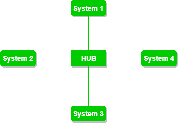
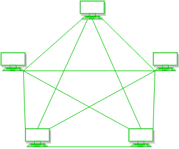

# 星形拓扑和网状拓扑的区别

> 原文:[https://www . geesforgeks . org/星网拓扑差异/](https://www.geeksforgeeks.org/difference-between-star-and-mesh-topology/)

先决条件–[网络拓扑](https://www.geeksforgeeks.org/network-topologies-computer-networks/)

**星型拓扑:**
在星型拓扑中，节点连接到中心集线器或路由器，其中信息从中心集线器或路由器传播到所有节点。如果有 n 个节点，星形拓扑中有 n 条链路。这些节点通过专用链路完全相互连接，在专用链路中，信息从一个节点传播到另一个节点。

**图–**星形拓扑

**网状拓扑:**
在网状拓扑中，节点通过专用链路完全相互连接，其中信息从节点传播到节点，如果有 N 个节点，网状拓扑中有 N(N-1)/2 个链路。

**图–**网状拓扑

**星形拓扑和网状拓扑的区别:**

| S.NO | 星形布局 | 网状拓扑 |
| 1. | 在星型拓扑中，节点连接到中央集线器或路由器。 | 在网状拓扑中，节点通过专用链路完全相互连接。 |
| 2. | 如果有 N 个节点，星形拓扑中有 N 条链路。 | 如果有 N 个节点，网状拓扑中有 N(N-1)/2 条链路。 |
| 3. | 星型拓扑的成本更低。 | 网状拓扑的成本很高。 |
| 4. | 星型拓扑的复杂性相当简单。 | 网状拓扑的复杂性是复杂的。 |
| 5. | 在星型拓扑中，信息从中央集线器或路由器传输到所有节点。 | 在网状拓扑中，信息从一个节点传播到另一个节点。 |
| 6. | 星型拓扑具有很好的可扩展性。 | 网状拓扑的可扩展性较差。 |
| 7. | 在星型拓扑中，双绞线电缆用于连接。 | 在网状拓扑中，双绞线、同轴电缆和光纤电缆根据网络类型进行连接。 |
| 8. | 星型拓扑用于局域网，因为设置简单。 | 广域网采用网状拓扑。 |