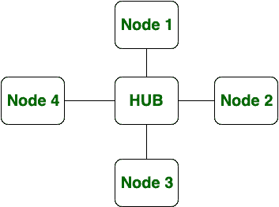
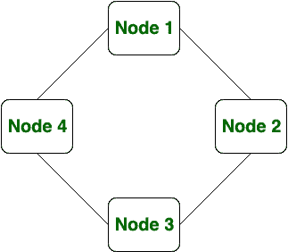

# 星形拓扑和环形拓扑的区别

> 原文:[https://www . geesforgeks . org/星环拓扑差异/](https://www.geeksforgeeks.org/difference-between-star-and-ring-topology/)

先决条件–[网络拓扑](https://www.geeksforgeeks.org/network-topologies-computer-networks/)
**星型拓扑:**
在星型拓扑中，节点连接到中心集线器或路由器，信息从中心集线器或路由器传输到所有节点。如果有 n 个节点，星形拓扑中有 n 条链路。这些节点通过专用链路完全相互连接，在专用链路中，信息从一个节点传播到另一个节点。新电缆被添加到中心集线器，以在星型拓扑中添加新节点。

**环形拓扑:**
在环形拓扑中，每个节点都连接到它的左侧和右侧节点，其中信息以环形方式在一个方向上从一个节点传播到另一个节点。如果存在 n 个节点，那么环形拓扑中也有 n 条链路，就像星形拓扑一样。在环形拓扑中，要添加新节点，必须断开整个连接。

**星形拓扑和环形拓扑的区别:**

| S.NO | 星形布局 | 环形拓扑 |
| 1. | 在星型拓扑中，节点连接到中央集线器或路由器。 | 在环形拓扑中，每个节点都连接到它的左侧和右侧节点。 |
| 2. | 在星型拓扑中，只有集线器是故障点。 | 在环形拓扑中，每个节点都是故障点。 |
| 3. | 星型拓扑的成本很高。 | 环形拓扑的成本较低。 |
| 4. | 在星型拓扑中，信息从中央集线器或路由器传输到所有节点。 | 在环形拓扑中，信息以环形方式在一个方向上从一个节点传播到另一个节点。 |
| 5. | 星形拓扑比环形拓扑更需要电缆。 | 环形拓扑比星形拓扑需要的电缆少。 |
| 6. | 如果有 n 个节点，星形拓扑中有 n 条链路。 | 如果有 n 个节点，环形拓扑中也有 n 条链路。 |
| 7. | 新电缆被添加到中心集线器以添加新节点。 | 而要在环形拓扑中添加新节点，连接必须断开。 |
| 8. | 在星型拓扑中，添加和删除新节点相当困难。 | 在环形拓扑中，添加和删除新节点很困难。 |