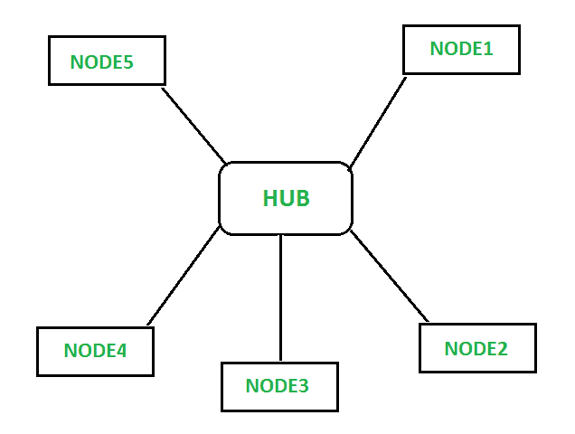
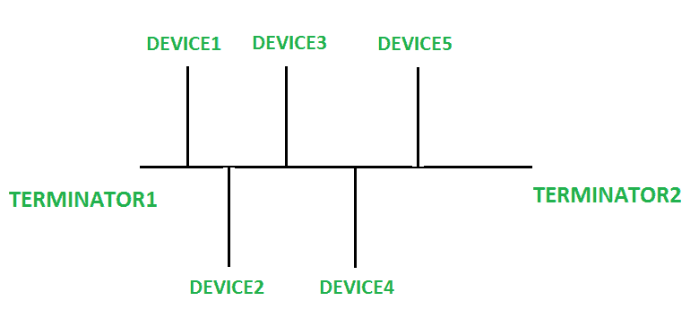

# 星型拓扑和总线拓扑的区别

> 原文:[https://www . geesforgeks . org/星型拓扑和总线拓扑的区别/](https://www.geeksforgeeks.org/difference-between-star-topology-and-bus-topology/)

先决条件–[网络拓扑类型](https://www.geeksforgeeks.org/types-of-network-topology/)

**1。星形拓扑:**
星形拓扑基本上用于局域网，其中所有节点都连接到一个称为集线器的中心点，集线器将它们连接到通信通道中。连接的方式是需要 n 根导线来连接 n 个终端设备或节点。交通是从恒星的中心枢纽产生的。中心集线器控制所有节点之间的通信，一个节点发送的消息首先到达集线器，然后通过集线器传输到接收节点。

**2。总线拓扑:**
总线拓扑是一种网络拓扑，其中所有设备都连接到一根称为网络主干的电缆。它由电缆两端的终端组成。网线负责设备之间的通信，当数据到达网线末端时，它会被终结器从数据线上移除。当设备以线性方式连接时，这是最简单的网络拓扑。

## 

**星型拓扑和总线拓扑的区别:**

<figure class="table">

| 没有 | 星形布局 | 总线拓扑 |
| --- | --- | --- |
| 1. | 星型拓扑是一种所有设备都连接到一个中心集线器的拓扑。 | 总线拓扑是一种拓扑，其中每个设备都连接到一根称为主干的电缆。 |
| 2. | 在星型拓扑中，如果中心集线器出现故障，则整个网络都会出现故障。 | 在总线拓扑中，网线的故障会导致整个网络出现故障。 |
| 3. | 高流量的管理和网络的性能高度依赖于中心枢纽的容量。 | 总线拓扑不能有效地管理终结器的大量流量，就好像有大量流量，那么网络的性能就会受到影响。 |
| 4. | 星型拓扑没有任何终结器。 | 总线拓扑在网络两端都有一个终结器。 |
| 5. | 星型拓扑的实施成本很高，因为需要中心集线器和额外的连接线。 | 总线拓扑比星型拓扑便宜。 |
| 6. | 星型拓扑中的数据传输速度更快。 | 在总线拓扑中，数据传输速度比星型拓扑慢。 |
| 7. | 在星型拓扑中，节点之间的通信是通过一个中心集线器完成的，来自发送方节点的消息首先到达中心集线器，然后传输到接收方节点。 | 在总线拓扑中，数据从发送设备直接发送到接收设备。 |
| 8. | 扩张更容易。 | 网络扩展，即添加新节点是困难的。 |
| 9. | 故障识别和隔离相对容易。 | 故障识别和隔离并不容易。 |
| 10. | 数据冲突的可能性更小， | 数据冲突经常发生 |

</figure>