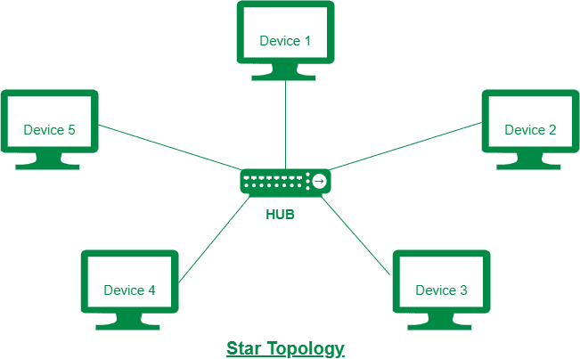
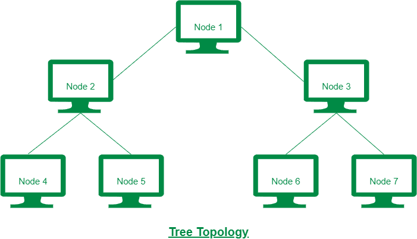

# 星型拓扑和树形拓扑的区别

> 原文:[https://www . geesforgeks . org/星型拓扑和树形拓扑的区别/](https://www.geeksforgeeks.org/difference-between-star-topology-and-tree-topology/)

**1。星型拓扑:**
星型拓扑是一种[网络拓扑](https://www.geeksforgeeks.org/types-of-network-topology/)，其中所有节点都连接到中央集线器或路由器。在星型拓扑中，连接的方式是，对于 n 个节点，需要 n 个链路。星型拓扑因其简单性而不那么复杂。星型拓扑比树形拓扑便宜。

**2。树拓扑:**
树拓扑是一种网络拓扑，其中节点以树的形式组织。在树形拓扑中，设计从顶部开始，即分支电缆开始的根部。没有环路的分支电缆将根节点与所有其他节点连接起来进行通信。树型拓扑更昂贵，因为它布线密集。

星型拓扑和树形拓扑的区别如下:

| 没有。 | 星形布局 | 树形布局 |
| --- | --- | --- |
| 1. | 星型拓扑是节点连接到中心集线器或路由器的拓扑。 | 树拓扑是节点以树的形式组织的拓扑。 |
| 2. | 在星型拓扑中，节点之间的通信是通过中心节点完成的，即集线器或路由器。 | 在树形拓扑中，节点之间的通信是通过没有环路的分支电缆完成的。 |
| 3. | 星型拓扑的复杂性真的很简单。 | 树形拓扑的复杂性在很大程度上是复杂的。 |
| 4. | 星型拓扑的成本低于树形拓扑。 | 树拓扑的成本很高，因为它是密集布线的。 |
| 5. | 星型拓扑也称为星型网络。 | 树形拓扑也称为层次拓扑。 |
| 6. | 星型拓扑用于局域网，因为设置和修改很容易。 | 广域网采用树形拓扑。 |

