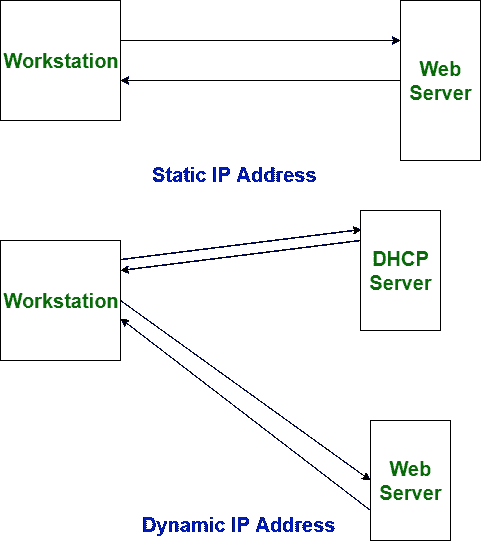

# 静态和动态 IP 地址的区别

> 原文:[https://www . geesforgeks . org/静态和动态 ip 地址的区别/](https://www.geeksforgeeks.org/difference-between-static-and-dynamic-ip-address/)

**IP** 代表**互联网协议**。IP 地址可以是分配给网络上每个设备的独特数字符号，以明确指出每个附属关系。

静态和动态 IP 地址的区别在于分配的科学学科地址的长度。静态科学学科地址是固定的科学学科地址，它被手动分配给一个工具很长一段时间。另一方面，每当用户启动他/她的机器时，动态科学学科地址经常会改变，而且是机械分配的。

**静态和动态 IP 地址的区别:**

| S.NO | 静态 IP 地址 | 动态 IP 地址 |
| --- | --- | --- |
| 1. | 它由互联网服务提供商提供。 | 而它是由动态主机配置协议提供的。 |
| 2. | 静态 ip 地址不会随时改变，这意味着如果提供了静态 ip 地址，那么它就不能被改变或修改。 | 而动态 ip 地址随时变化。 |
| 3. | 静态 ip 地址不太安全。 | 而在动态 ip 地址中，风险比静态 ip 地址低。 |
| 4. | 静态 ip 地址很难指定。 | 而动态 ip 地址很容易指定。 |
| 5. | 静态 ip 地址设计的设备可以跟踪。 | 但是动态 ip 地址设计的设备无法追踪。 |
| 6. | 静态 ip 地址比动态 ip 地址更稳定。 | 而动态 ip 地址不如静态 ip 地址稳定。 |
| 7. | 维护静态 ip 地址的成本高于动态 ip 地址。 | 而动态 ip 地址的维护成本低于静态 ip 地址。 |
| 8. | 它用于计算数据不太保密的地方。 | 而在数据更机密、需要更安全的地方使用。 |