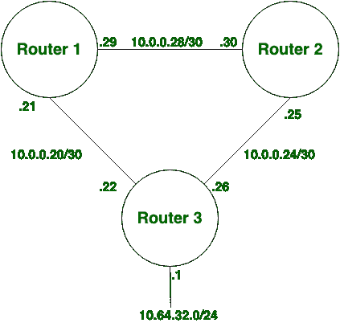
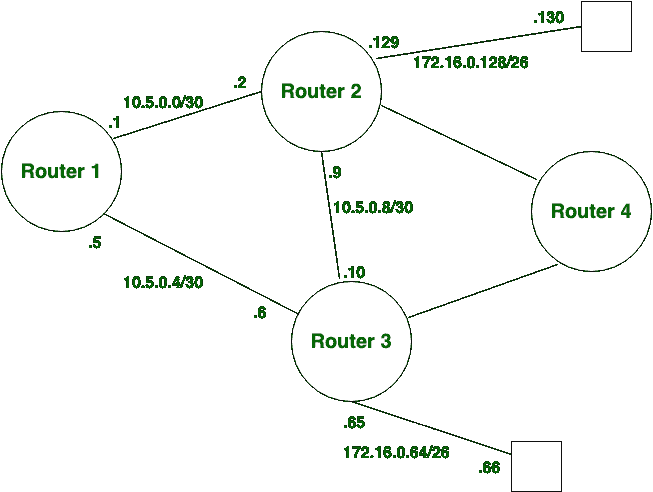

# 静态路由和动态路由的区别

> 原文:[https://www . geesforgeks . org/静态路由和动态路由的区别/](https://www.geeksforgeeks.org/difference-between-static-and-dynamic-routing/)

静态路由和动态路由都是路由的[类型](https://www.geeksforgeeks.org/computer-network-types-routing/)。
**静态路由:**
静态路由也称为**非自适应**路由，除非网络管理员手动更改或修改，否则不会更改路由表。静态路由不使用复杂的路由算法，它比动态路由提供更高或更高的安全性。

**动态路由:**
动态路由又称**自适应**路由，它根据拓扑的变化来改变路由表。动态路由使用复杂的路由算法，不像静态路由那样提供高安全性。当网络发生变化(拓扑)时，它会向路由器发送消息以确保发生变化，然后重新计算路由以发送更新的路由信息。

**静态路由和动态路由的区别:**

| S.NO | 静态路由 | 动态路由 |
| 1. | 在静态路由中，路由是用户定义的。 | 在动态路由中，路由根据拓扑进行更新。 |
| 2. | 静态路由不使用复杂的路由算法。 | 动态路由使用复杂的路由算法。 |
| 3. | 静态路由提供了更高的安全性。 | 动态路由安全性较低。 |
| 4. | 静态路由是手动的。 | 动态路由是自动化的。 |
| 5. | 静态路由在小型网络中实现。 | 动态路由在大型网络中实现。 |
| 6. | 在静态路由中，不需要额外资源。 | 在动态路由中，需要额外的资源。 |
| 7. | 在静态路由中，链路故障会中断重新路由。 | 在动态路由中，链路故障不会中断路由。 |