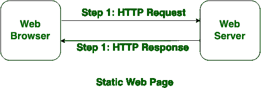
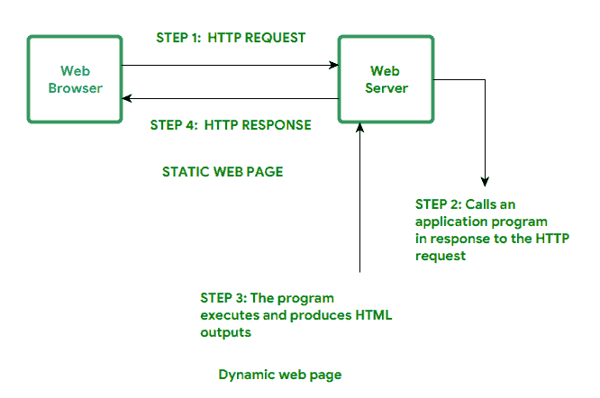

# 静态和动态网页的区别

> 原文:[https://www . geesforgeks . org/静态网页和动态网页的区别/](https://www.geeksforgeeks.org/difference-between-static-and-dynamic-web-pages/)

**静态网页:**
静态网页很简单。它是用 HTML、JavaScript、CSS 等语言编写的。对于静态网页，当服务器收到对网页的请求时，服务器会将响应发送给客户端，而不进行任何额外的处理。这些网页可以通过网络浏览器看到。在静态网页中，页面将保持不变，直到有人手动更改它。

**动态网页:**
动态网页是用 CGI、AJAX、ASP、ASP.NET 等语言编写的。在动态网页中，页面的内容对于不同的访问者是不同的。加载比静态网页需要更多的时间。动态网页用于信息经常变化的地方，例如股票价格、天气信息等。

**静态和动态网页的区别:**

| SL.NO | 静态网页 | 动态网页 |
| 1. | 在静态网页中，页面将保持不变，直到有人手动更改它。 | 在动态网页中，对于不同的访问者，网页的内容是不同的。 |
| 2. | 就复杂性而言，静态网页很简单。 | 动态网页很复杂。 |
| 3. | 在静态网页中，信息很少变化。 | 在动态网页中，信息变化频繁。 |
| 4. | 静态网页比动态网页需要更少的加载时间。 | 动态网页加载需要更多时间。 |
| 5. | 在静态网页中，不使用数据库。 | 在动态网页中，使用数据库。 |
| 6. | 静态网页是用 HTML、JavaScript、CSS 等语言编写的。 | 动态网页是用 CGI、AJAX、ASP、ASP.NET 等语言编写的。 |
| 7. | 静态网页不包含任何应用程序。 | 动态网页包含不同服务的应用程序。 |
| 8. | 静态网页在设计时需要较少的工作和成本。 | 动态网页的设计需要相对更多的工作和成本。 |