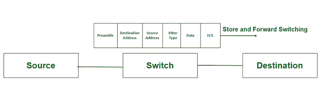
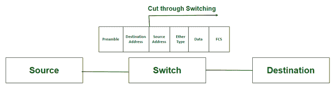

# 存储转发切换和直通切换的区别

> 原文:[https://www . geesforgeks . org/商店间差异% E2 % 80% 91 和% E2 % 80% 91 前向切换和剪切% E2 % 80% 91 通过切换/](https://www.geeksforgeeks.org/difference-between-store%e2%80%91and%e2%80%91forward-switching-and-cut%e2%80%91through-switching/)

交换是一种用于在网络之间传输数据的技术。这是通过使用用于连接多个局域网的交换机来实现的。交换机根据其媒体访问控制地址转发数据包。交换用于有效地利用网络带宽，减少数据包之间的冲突。交换技术有三种类型–[电路交换](https://www.geeksforgeeks.org/circuit-switching-in-computer-network/)、[消息交换](https://www.geeksforgeeks.org/message-switching-techniques/)和[分组交换](https://www.geeksforgeeks.org/packet-switching-and-delays-in-computer-network/)。

交换模式用于通过识别数据帧的不同部分来转发数据包，如前导码、目的地址、源地址、以太类型、要发送的数据和 FCS。主要有两种类型的切换方法- [直通切换](https://www.geeksforgeeks.org/what-is-cut-through-switching/?ref=rp)和存储转发切换。

### **存储转发切换:**

存储转发交换是交换设备交换数据包的一种方法，交换设备接收数据帧，然后在转发数据包之前检查错误。它支持高效传输未损坏的帧。它通常用于电信网络。

在存储转发交换中，交换设备等待接收整个帧，然后将该帧存储在缓冲存储器中。然后，使用循环冗余校验(CRC)检查帧是否有错误。如果发现错误，则丢弃数据包，否则将其转发到下一个设备。

存储和转发交换

### **直通切换:**

直通交换是交换设备交换数据包的一种方法，它在目的地址可用时立即转发数据包，而无需等待其余数据到达。它支持低延迟和高速传输，并且需要更少的存储空间。用于光纤通道传输、SCSI 流量传输等。

在直通交换中，一旦目的地址字段到达交换设备，数据传输就开始。然后，设备执行查找操作来检查目的地址是否有效。如果发现地址有效，并且到目的地的链路可用，则交换设备开始向目的地发送数据包，而不等待帧的剩余部分到达。

直通交换

**直通交换和存储转发交换的区别:**

<figure class="table">

| 

存储转发交换

 | 

直通交换

 |
| --- | --- |
| 交换设备在转发数据包之前等待接收整个帧。 | 一旦接收到目的地址，交换设备就转发数据包，而不等待整个帧被接收。 |
| 它支持错误检查，在转发数据包之前会丢弃冲突/坏帧。 | 没有错误检查技术。 |
| 它根据数据帧的 FCS 位检查错误。 | 它依赖更高级别的协议来检测错误。 |
| 帧存储在交换设备的缓冲存储器中。 | 帧不存储在交换设备中。 |
| 它没有进一步分为不同的类型。 | 直通交换进一步分为快速帧转发和无碎片。 |
| 它的延迟率很高，因为设备在将数据包发送到目的地之前会等待整个帧被接收。 | 它的延迟率较低，因为设备在将数据包发送到目的地之前不会等待整个帧被接收。 |
| 它更安全，因为它不会将损坏的帧转发到目的地。 | 它不太安全，因为它有时会将损坏的帧转发到目的地。 |
| 它有很长的等待时间，因为交换设备在转发整个帧之前要等待整个帧被接收。 | 它的等待时间很短，因为它一收到目的地址就转发帧。 |
| 它不限制交换机中的路由或仲裁决策。 | 它限制了源和目的地之间交换机的路由或仲裁决策。 |
| 它有更多存储需求的网络。 | 它对存储的要求更低。 |
| 例如:电信网络或需要高移动性的跨网络传输。 | 例如:通过光纤通道通信和用于 SCSI 传输的低延迟传输。 |

</figure>