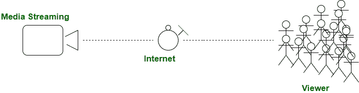

# 流媒体和下载的区别

> 原文:[https://www . geesforgeks . org/流媒体与下载的区别/](https://www.geeksforgeeks.org/difference-between-streaming-and-downloading/)

流媒体和下载，这两个术语在我们使用互联网时使用得最多。让我们一个一个地看这些术语，我们会看到它们之间的区别。

**流式传输:**
流式传输是指在远程机器(服务器)而不是购物者机器内观看保持的内容。然而，现在这种流媒体会起作用吗？在媒体和应用程序的流式传输中，媒体比特流被分割成小块或块，区域单元被分别传输。这样，接收器就能够对终端用户在特定时间接收的比特流部分进行编码和回放。
因此，然而这可能是发射机系统地发送多媒体系统知识的分组，而接收机同时接受、解码和检查比特流的接收部分。

**下载:**
下载与流媒体完全不同；它包括在查看内容之前，从服务器将内容存储在客户机上。这通常是以文件传输协议为例来解释的，在该协议中，文件首先被下载，然后才被覆盖。下载可能是将内容传递给最终用户的强大技术。它消除了内容的缓冲，因为它发生在流传输时。

**流媒体和下载的区别:**

| S.NO | 流动 | 下载 |
| --- | --- | --- |
| 1. | 流式传输是逐块传输内容并随后观看的过程。 | 下载是一种方法，在此过程中，所有信息都被迅速传输，然后被查看。 |
| 2. | 在流式传输中，需要稳定和合理的网速。 | 在下载时，变速可能会联合工作。 |
| 3. | 所需时间更少。 | 需要更多时间。 |
| 4. | 缓冲存在于流的情况下。 | 这里，缓冲不存在。 |
| 5. | 如果网络或网速良好，屏幕分辨率可能会更高。 | 这里，屏幕分辨率取决于下载器。 |
| 6. | 在流式传输的情况下，同时不需要内存空间。 | 这里，下载多媒体内容需要内存空间。 |
| 7. | 在流式传输的情况下，视频质量可以在过程之间改变。 | 在这里，一旦开始下载，视频质量就无法改变。 |