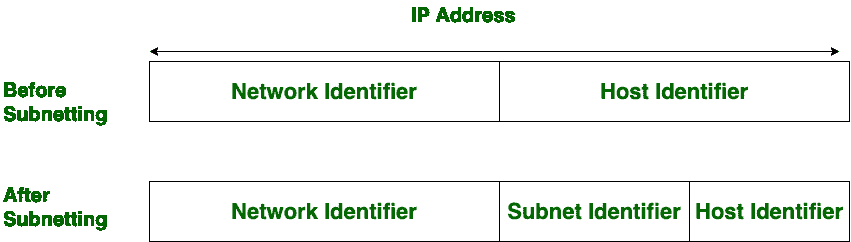

# 子网划分和超网划分的区别

> 原文:[https://www . geeksforgeeks . org/子网划分和超网划分的区别/](https://www.geeksforgeeks.org/difference-between-subnetting-and-supernetting/)

****:**
子网划分是将网络划分为子网或小网络的过程。**

******:**
超网是将小网络组合成更大空间的过程。在划分子网时，网络地址的位数会增加。另一方面，在超网中，主机地址的位数会增加。子网划分通过可变长度子网掩码实现，而超网划分通过无类域间路由实现。****

********

******子网划分和超网划分的区别:******

<figure class="table">

| S.NO | 

子网划分

 | 

超网

 |
| --- | --- | --- |
| 1. | 子网划分是将网络划分为子网的过程。 | 而超网则是将小网络合并的过程。 |
| 2. | 在划分子网时，网络地址的位数会增加。 | 在超网时，主机地址的位数会增加。 |
| 3. | 在子网划分中，掩码位向右移动。 | 在超网中，掩码位向左移动。 |
| 4. | 子网划分是通过可变长度子网掩码实现的。 | 而超网是通过无类域间路由实现的。 |
| 5. | 在子网划分中，减少或消除了地址损耗。 | 而它用于简化路由过程。 |

</figure>