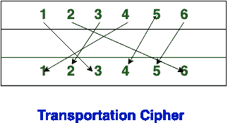

# 替代密码技术与换位密码技术的区别

> 原文:[https://www . geeksforgeeks . org/替换-密码-技术和转置-密码-技术的区别/](https://www.geeksforgeeks.org/difference-between-substitution-cipher-technique-and-transposition-cipher-technique/)

**替换密码技术**和**换位密码技术**都是传统密码的[类型，用于将明文转换为密文。](https://www.geeksforgeeks.org/cryptography-traditional-symmetric-ciphers/)

**替换密码技术:**
在替换密码技术中，纯文本字符被其他字符、数字和符号替换，在替换密码技术中，字符的身份被改变，而其位置保持不变。

**换位密码技术:**
换位密码技术重新排列纯文本字符的位置。在换位密码技术中，字符的位置被改变，但字符的身份不变。

**替换密码技术与换位密码技术的区别:**

<figure class="table">

| S.NO | 替代密码技术 | 换位密码技术 |
| 1. | 在替换密码技术中，纯文本字符被其他字符、数字和符号替换。 | 在换位密码技术中，纯文本字符根据位置重新排列。 |
| 2. | 替代密码的形式有:单字母替代密码和多字母替代密码。 | 换位密码的形式有:无密钥换位密码和有密钥换位密码。 |
| 3. | 在替换密码技术中，字符的身份被改变，而其位置保持不变。 | 而在换位密码技术中，字符的位置是变化的，但字符的身份是不变的。 |
| 4. | 在替代密码技术中，低频字母可以检测纯文本。 | 而在换位密码技术中，更接近正确密钥的密钥可以公开明文。 |
| 5. | 替代密码的例子是凯撒密码。 | 换位密码的例子是围栏密码。 |

</figure>