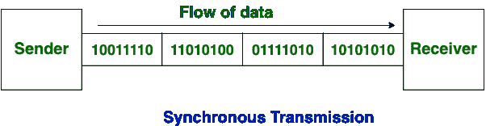
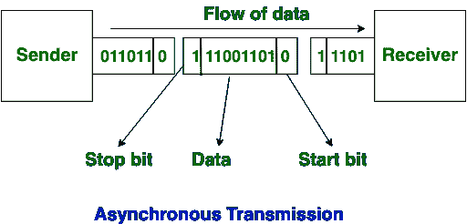

# 同步和异步传输的区别

> 原文:[https://www . geesforgeks . org/同步和异步传输的区别/](https://www.geeksforgeeks.org/difference-between-synchronous-and-asynchronous-transmission/)

**[同步传输](https://www.geeksforgeeks.org/computer-organization-synchronous-data-transfer/) :**
在同步传输中，数据以块或帧的形式发送。这种传输是全双工类型。发送方和接收方之间的同步是强制性的。在同步传输中，数据之间没有间隙。传输大量数据比异步传输更有效、更可靠。

**[异步传输](https://www.geeksforgeeks.org/asynchronous-serial-data-transfer/) :**
在异步传输中，数据以字节或字符的形式发送。这种传输是半双工类型的传输。在这种传输中，开始位和停止位与数据相加。它不需要同步。

现在，让我们看看同步和异步传输的区别:

| S.NO | 同步传输 | 异步传输 |
| 1. | 在同步传输中，数据以块或帧的形式发送。 | 在异步传输中，数据以字节或字符的形式发送。 |
| 2. | 同步传输快。 | 异步传输很慢。 |
| 3. | 同步传输成本高。 | 异步传输是经济的。 |
| 4. | 在同步传输中，传输的时间间隔是恒定的。 | 在异步传输中，传输的时间间隔不是常数，而是随机的。 |
| 5. | 在同步传输中，数据之间没有间隙。 | 在异步传输中，数据之间存在间隙。 |
| 6. | 传输线的有效利用是在同步传输中完成的。 | 而在异步传输中，传输线路在字符传输间隙中保持空闲。 |
| 7. | 同步传输需要精确同步的时钟来获取新字节的信息。 | 异步传输不需要同步时钟，因为奇偶校验位用于新字节信息的传输。 |