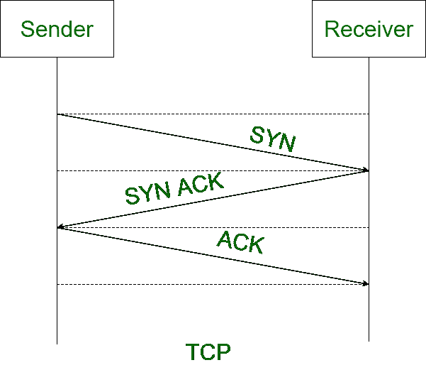
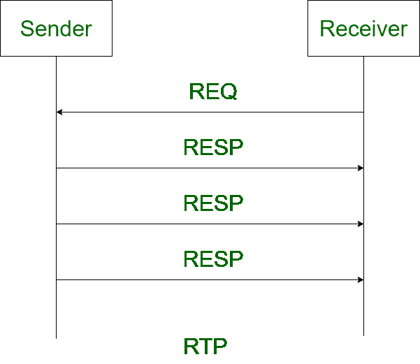

# TCP 和 RTP 的区别

> 原文:[https://www . geesforgeks . org/TCP 和 rtp 之间的差异/](https://www.geeksforgeeks.org/difference-between-tcp-and-rtp/)

**1。 [TCP](https://www.geeksforgeeks.org/tcp-ip-model/) :**
TCP 是一种[面向连接的协议](https://www.geeksforgeeks.org/difference-between-connection-oriented-and-connection-less-services/)，其中通信设备在传输数据之前建立连接，在传输数据之后关闭连接。

**2。**
实时传输协议是一种网络协议，用于通过网络传输音频和视频。RTP 基本上用于涉及流媒体的通信和娱乐系统。

以下是传输控制协议和实时传输协议区别:

| 传输控制协议（Transmission Control Protocol） | 实时位置（Real-TimePosition 的缩写） |
| --- | --- |
| TCP 代表传输控制协议。 | 实时传输协议代表实时传输协议。 |
| TCP 是一种面向连接的协议，这意味着通信设备在传输数据之前建立连接，在传输数据之后关闭连接。 | RTP 是一种网络协议，用于通过网络传送音频和视频。 |
| 这是一个无损协议。 | 这是一个无状态协议。 |
| 这是一个缓慢的过程。 | 它比 TCP 更快。 |
| TCP 还提供流量控制。 | 它不提供流量控制。 |
| 它不能容忍数据包丢失。 | 它可以容忍数据包丢失。 |
| TCP 通常不用于实时流。 | 实时传输协议用于实时流传输。 |
| TCP 更可靠。 | RTP 不太可靠。 |

