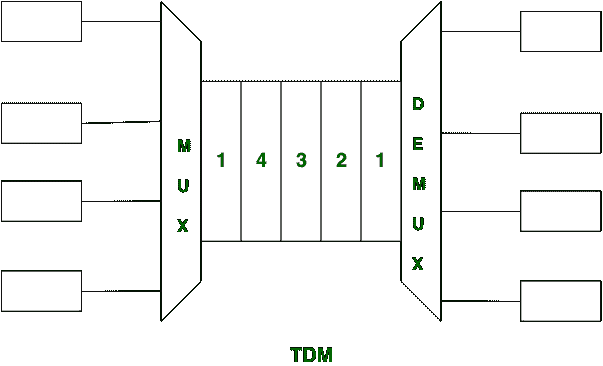
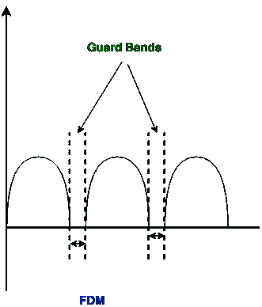

# 时分复用和 FDM 的区别

> 原文:[https://www . geesforgeks . org/TDM 和-fdm 之间的区别/](https://www.geeksforgeeks.org/difference-between-tdm-and-fdm/)

先决条件–[频分和时分复用](https://www.geeksforgeeks.org/computer-network-frequency-division-and-time-division-multiplexing/)
**时分复用(TDM):**
TDM 是复用技术。时分复用与模拟信号一样处理数字信号。在时分复用中，同步脉冲很重要。时分复用共享各种信号的时间尺度。它有两种类型:

```
1. Synchronous TDM
2. Asynchronous TDM 
```



**频分复用(FDM):**
FDM 是用于模拟系统的复用技术。在 FDM，需要保护频带，而 FDM 的频谱效率较低。在 FDM，带宽(B)致力于不同的来源。



让我们看看时分复用和 FDM 的区别:

<center>

| S.NO | 双座自行车 | 频分多路复用(frequency-division multiplexing) |
| 1. | 时分复用代表时分复用。 | FDM 代表频分复用。 |
| 2. | 时分复用既可以处理模拟信号，也可以处理数字信号。 | 而 FDM 只处理模拟信号。 |
| 3. | TDM 冲突低。 | 而它有很高的冲突。 |
| 4. | TDM 的布线或芯片简单。 | 虽然它的布线或芯片是复杂的，而不是简单的。 |
| 5. | TDM 是高效的。 | 虽然效率很低。 |
| 6. | 在时分复用中，时间共享发生。 | 在这种情况下，会发生频率共享。 |
| 7. | 在时分复用中，同步脉冲是必要的。 | 在里面，守卫带是必要的。 |

</center>