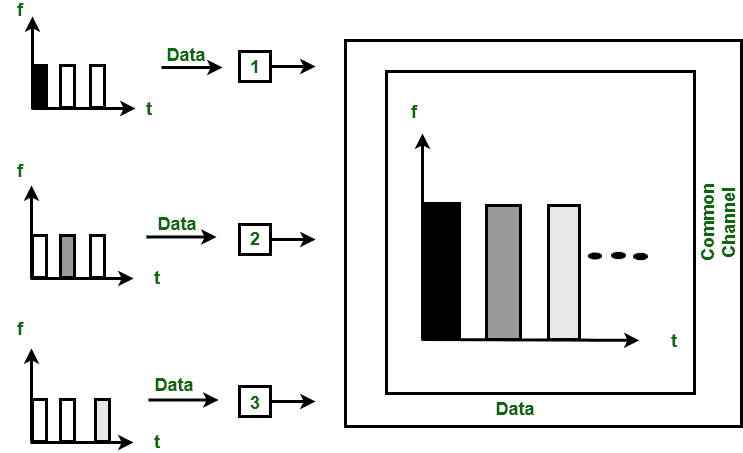

# 时分多址和码分多址的区别

> 原文:[https://www . geeksforgeeks . org/tdma 和 cdma 的区别/](https://www.geeksforgeeks.org/difference-between-tdma-and-cdma/)

**1。时分多址(时分多址):**
时分多址是一种信道化协议，其中信道带宽按时间划分给不同的站。每个站都有一个时隙，该站只能在该时隙内传输数据，如下所示:

每个站必须知道其时隙的开始和时隙的位置。时分多址需要不同站之间的同步。它是数据链路层的一种访问方法。在每个站点，数据链路层告诉站点使用分配的时隙。

**2。码分多址(CDMA) :**
在 CDMA 中，所有的站都可以同时传输数据。它允许每个站一直在整个频率上传输数据。多个同时传输由唯一的代码序列分开。每个用户都被分配了一个唯一的代码序列。

在上图中，有 4 个站点标记为 1、2、3 和 4。分配给各站的数据为 d 1 、d 2 、d 3 和 d 4 ，分配给各站的代码为 c 1 、c 2 、c 3 和 c 4 。

**时分多址和码分多址的区别:**

| 南号码 | 分时多址(Time Division Multiple Address) | 分码多重进接ˌ码分多址(Code Division Multiple Access) |
| --- | --- | --- |
| 1. | 时分多址代表时分多址。 | 码分多址代表码分多址。 |
| 2. | 在这种情况下，只有卫星转发器的时间共享发生。 | 在这种情况下，不同站点共享带宽和时间。 |
| 3. | 不需要任何码字。 | 不需要任何码字。 |
| 4. | 在这种情况下，相邻时隙的保护时间是必要的。 | 在这种情况下，保护带和保护时间都是必要的。 |
| 5. | 需要同步。 | 不需要同步。 |
| 6. | 系统的容量是平均的。 | 系统容量很大。 |
| 7. | 它不如码分多址灵活。 | 灵活性高。 |
| 8. | 在这方面，不存在远近问题。 | 存在远近问题。 |
| 9. | 数据速率是平均的。 | 数据率很高。 |

