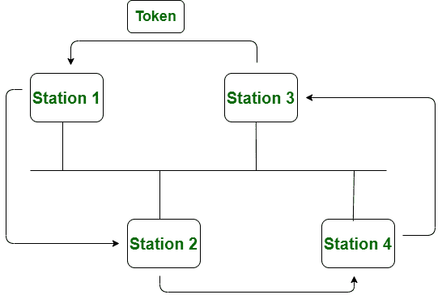
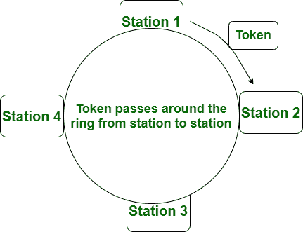

# 令牌总线和令牌环网的区别

> 原文:[https://www . geesforgeks . org/令牌总线和令牌环网的区别/](https://www.geeksforgeeks.org/difference-between-token-bus-and-token-ring-network/)

**[令牌总线](https://www.geeksforgeeks.org/token-bus-ieee-802-4/) :**
令牌总线网络是令牌沿虚拟环传递的标准。在令牌总线网络中，总线拓扑被用作物理介质。

在这种情况下，虚拟环是用站创建的，因此令牌随后在该虚拟环的序列期间从站传递。toke 总线网络中的每个站或节点都知道它的前一站和后一站的地址。当且仅当节点(站)具有令牌时，它才能传输数据。它的工作原理类似于令牌环网。

**[令牌环](http://geeksforgeeks.org/efficiency-of-token-ring/) :**
由 IEEE 802.5 标准定义。在令牌环网络中，令牌通过物理环而不是虚拟环传递。

在这种情况下，令牌是一种特殊的帧，只有当站点拥有令牌时，它才能传输数据帧。并且令牌在成功接收到数据帧时被发放。

我们来看看令牌总线和令牌环的区别:-

| S.NO | 令牌总线网络 | 令牌环网 |
| --- | --- | --- |
| 1. | 在令牌总线网络中，令牌沿着虚拟环传递。 | 在令牌环网络中，令牌通过物理环传递。 |
| 2. | 令牌总线网络只是为大型工厂设计的。 | 而令牌环网是为办公室设计的。 |
| 3. | 令牌总线网络由 IEEE 802.4 标准定义。 | 而令牌环网是由 IEEE 802.5 标准定义的。 |
| 4. | 令牌总线网络提供了更好的带宽。 | 而令牌环网与令牌总线相比没有提供更好的带宽。 |
| 5. | 在令牌总线网络中，使用总线拓扑。 | 而在令牌环网中，则采用星型拓扑。 |
| 6. | 无法计算到达令牌总线网络中最后一站所需的最长时间。 | 同时可以计算到达令牌环网中最后一站的最大时间。 |

