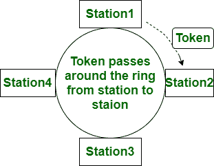

# 令牌环和以太网的区别

> 原文:[https://www . geesforgeks . org/令牌环网与以太网的区别/](https://www.geeksforgeeks.org/difference-between-token-ring-and-ethernet/)

**1。** [**令牌环**](https://www.geeksforgeeks.org/token-ring-frame-format/) **:**
在令牌环中，令牌环经过物理环。令牌环由 IEEE 802.5 标准定义。在令牌环网中，有一个站和一个称为令牌的特殊帧。令牌环中的站点可以传输包含令牌的数据帧。数据帧成功传输后，令牌被指向(发出)。令牌环是星形拓扑，处理优先级，其中一些节点可能会优先考虑令牌。

**2。** [**以太网**](https://www.geeksforgeeks.org/local-area-network-lan-technologies/) **:**
IEEE 802.3 定义了以太网。它使用 CSMA/光盘机制。意思是如果同时有很多站存在通话，所有站都会关闭。要恢复它们，请随机等待一段时间。与令牌环不同，它不采用任何优先级。而且比令牌环网便宜。

让我们看看令牌环网和以太网的区别:-

<figure class="table">

| S.NO | 令牌网 | 以太网 |
| --- | --- | --- |
| 1. | 在令牌环中，使用令牌传递机制。 | 而以太网使用 CSMA/光盘(载波侦听多路访问/冲突检测)机制。 |
| 2. | 令牌环由 IEEE 802.5 标准定义。 | 而以太网是由 IEEE 802.3 标准定义的。 |
| 3. | 令牌环是确定性的。 | 而它是非确定性的。 |
| 4. | 令牌环是星形拓扑。 | 而以太网是总线型拓扑。 |
| 5. | 令牌环处理优先级，其中一些节点可以给予令牌优先级。 | 而以太网不采用优先级。 |
| 6. | 令牌环网比以太网更贵。 | 而以太网比令牌环网便宜百分之七十。 |
| 7. | 在令牌环中使用电话线。 | 而在以太网中使用同轴电缆(电线)。 |
| 8. | 令牌环包含路由信息。 | 而以太网不包含路由信息。 |
| 9. | 令牌环的传输速度较慢(一般工作在 4 Mbps 到 16 Mbps)。 | 它的传输速度更快(一般工作在 10 Mbps 到 100 Mbps)。 |

</figure>