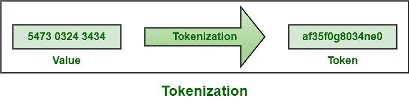
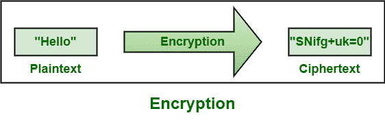

# 令牌化和加密的区别

> 原文:[https://www . geeksforgeeks . org/令牌化和加密的区别/](https://www.geeksforgeeks.org/difference-between-tokenization-and-encryption/)

**1。令牌化:**
令牌化，顾名思义，基本上是一种替换技术，用随机生成的代码(称为令牌)替换敏感数据。这里，令牌通常用作原始数据的引用或占位符。它只是保留了数据的感觉和格式，也保留了数据主体的隐私。它通常用于信用卡处理，以增加安全性。

**例:**

**2。加密:**
加密，顾名思义，就是将数学算法和一些其他的秘密信息结合起来，以一种没有合适的密钥基本上不可能逆转的方式对数据进行转换或转化的过程。它只是使用算法将纯文本信息转换成不可读的密文。它也可以反转，以便授权人员可以查看和使用原始和敏感数据。它被认为是实现数据安全的最有效方法。

**例:**

**令牌化和加密的区别:**

<figure class="table">

| 

**令牌化**

 | 

**加密**

 |
| --- | --- |
| 这是一个将敏感数据转化为非敏感数据的过程，通常称为令牌。 | 它是对消息、数据或文件进行编码的过程，以便只有特定的人才能访问和读取。 |
| 这很重要，因为它有助于降低数据泄露带来的风险，并建立与客户的信任。 | 它很重要，因为它有助于保护私人信息或敏感数据，并增强服务器和客户端应用程序之间的通信安全性。 |
| 它的主要目的是用相同格式但没有任何内在价值的随机数替换敏感数据，如支付卡或银行账号。 | 它的主要目标是保密性，例如通过将消息翻译成代码来隐藏消息内容。 |
| 它只能通过网络服务提供。 | 它既可以在本地提供，也可以作为网络服务提供。 |
| 它最适合结构化数据字段，因此主要用于保护支付处理系统中的敏感数据，如信用卡信息或社会安全号码。 | 它最适合未存储在多个系统中的非结构化字段或数据库，也最适合保护整个文件或电子邮件等文件，还支持支付卡号等结构化数据。 |
| 由于对令牌数据库的访问，很难交换数据。 | 交换数据更容易，因为如果需要，可以使用解密密钥访问原始数据。 |
| 它使用令牌来保护数据。 | 它使用密钥来保护数据。 |
| 在这种情况下，如果令牌被拦截，那么它就不能用来猜测真实值。 | 在这种情况下，如果密钥被截获，那么它也可以被用来解密它用来保护的所有数据。 |
| 这是一个不可逆的过程。 | 这是一个可逆的过程。 |
| 它为明文随机生成标记值，并将映射存储在数据库中。 | 它对数据进行加密，以便只有授权方才能访问数据。 |

</figure>